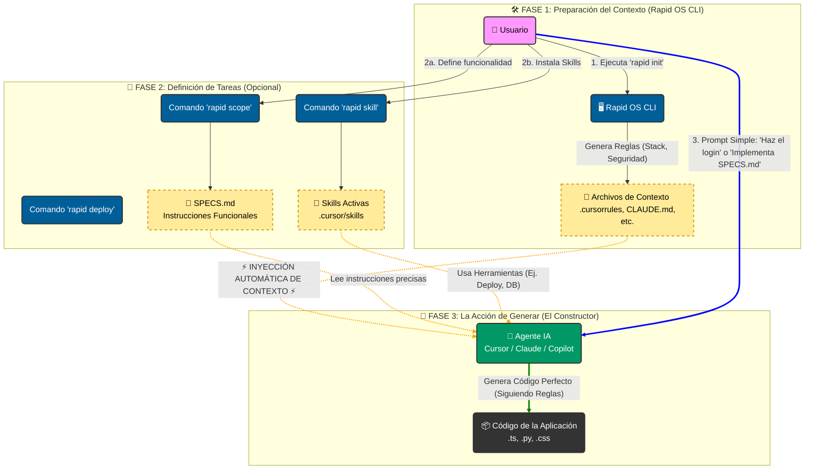

<a name="readme-top"></a>

<div align="center">

# ⚡ Rapid OS

### Context Injection for AI Engineering

Convierte a tus Agentes (Cursor, Claude, Antigravity) en Ingenieros Senior instantáneamente.

</div>

<details>
  <summary>Table of Contents</summary>
  <ol>
    <li><a href="#about-the-project">📖 About the Project</a></li>
    <li><a href="#how-it-works">🧩 How it Works</a></li>
    <li>
      <a href="#build-with">⚒️ Build With</a>
      <ul>
        <li><a href="#tech-stack">Tech Stack</a></li>
        <li><a href="#key-features">Key Features</a></li>
      </ul>
    </li>
    <li><a href="#live-demo">🚀 Live Demo</a></li>
    <li>
      <a href="#getting-started">💻 Getting Started</a>
      <ul>
        <li><a href="#setup">Setup</a></li>
        <li><a href="#prerequisites">Prerequisites</a></li>
        <li><a href="#install">Install</a></li>
      </ul>
    </li>
    <li><a href="#usage">Usage</a></li>
    <li><a href="#run-tests">Run tests</a></li>
    <li><a href="#deployment">Deployment</a></li>
    <li><a href="#authors">👥 Authors</a></li>
    <li><a href="#future-features">🕹️ Future Features</a></li>
    <li><a href="#contributing">🤝 Contributing</a></li>
    <li><a href="#show-your-support">⭐ Show your Support</a></li>
    <li><a href="#acknowledgements">👏 Acknowledgements</a></li>
    <li><a href="#faq">❓ FAQ</a></li>
    <li><a href="#license">📃 License</a></li>
  </ol>
</details>

---

## 📖 About the Project <a name="about-the-project"></a>

**Rapid OS** es un framework de "Inyección de Contexto" diseñado para resolver el problema de la **"Amnesia de Contexto"** en los LLMs.

Cuando trabajas con asistentes de IA como Cursor, Claude o Copilot, a menudo olvidan tus reglas de negocio, tu stack tecnológico o tus protocolos de seguridad. Rapid OS soluciona esto inyectando una **"Constitución de Proyecto"** estandarizada que la IA debe obedecer antes de escribir una sola línea de código.

<p align="right">(<a href="#readme-top">back to top</a>)</p>

## 🧩 How it Works <a name="how-it-works"></a>

Rapid OS actúa como el **Arquitecto** que define las reglas, mientras tu IA (Cursor/Claude) actúa como el **Constructor**.



<p align="right">(<a href="#readme-top">back to top</a>)</p>

## ⚒️ Build With <a name="build-with"></a>

### Tech Stack <a name="tech-stack"></a>

Este proyecto está construido utilizando tecnologías nativas para asegurar máxima compatibilidad y cero dependencias pesadas:

- **Core Logic**
- **Installer (Linux/Mac)**
- **Installer (Windows)**
- **Templates & Context**

### Key Features <a name="key-features"></a>

- **🧰 Gestor de Skills Híbrido**: Instala capacidades activas para tu IA desde dos fuentes:
  - _Remoto_: Acceso directo al ecosistema de la comunidad (`npx skills`) para instalar miles de herramientas.
  - _Local_: Usa tus propios templates privados (`templates/skills`) para estandarizar flujos de tu equipo.
- **🤖 Multi-Agente Modular**: No más ruido. Elige exactamente qué archivos de configuración generar: Cursor (`.cursorrules`), Claude Code (`CLAUDE.md`), Google Antigravity (`.agent/rules`) o VS Code.
- **🧠 Contexto de Negocio Inteligente**: Importa tus reglas de negocio desde archivos Markdown (`.md`) existentes o guárdalas como Plantillas reutilizables para futuros proyectos.
- **🏗️ Topologías Arquitectónicas**: Define si tu proyecto es Frontend Only, BaaS (Supabase) o Fullstack Separado para evitar alucinaciones de código.
- **🔌 Herramientas MCP (Model Context Protocol)**: Configura automáticamente servidores de base de datos (Postgres/Supabase) para que la IA pueda ejecutar consultas reales.
- **👁️ Soporte Multimodal (Vision)**: Inyecta capturas de pantalla y referencias visuales al contexto para diseños pixel-perfect.
- **🚀 Stacks Senior**: Templates pre-configurados para Web Moderno, Python AI, Creative Frontend, etc.
- **🛡️ Seguridad por Defecto**: Inyección automática de protocolos OWASP y reglas Anti-PII.
- **☁️ Asistente DevOps**: Genera archivos de IaC (Terraform, Docker) para AWS, Vercel y GCP.

<p align="right">(<a href="#readme-top">back to top</a>)</p>

## 🚀 Live Demo <a name="live-demo"></a>

Puedes ver a Rapid OS en acción transformando un proyecto vacío en un entorno configurado en segundos.

> [!NOTE]
> Insertar enlace a Video Demo o GIF aquí

<p align="right">(<a href="#readme-top">back to top</a>)</p>

## 💻 Getting Started <a name="getting-started"></a>

Sigue estos pasos para instalar Rapid OS en tu entorno local.

### Setup <a name="setup"></a>

No necesitas clonar este repositorio manualmente para usar la herramienta. El instalador se encargará de todo.

### Prerequisites <a name="prerequisites"></a>

Asegúrate de tener instalado:

- **Git**: Para control de versiones.
- **Python 3.8+**: Para ejecutar el núcleo de Rapid OS.
- **Node.js (Opcional)**: Requerido solo si deseas instalar Skills remotas usando `npx`.

### Install <a name="install"></a>

#### Opción A: Linux, macOS o WSL

```bash
curl -sL https://raw.githubusercontent.com/alyconr/Rapid-OS/main/install.sh | bash
```

#### Opción B: Windows (PowerShell Nativo)

```powershell
irm https://raw.githubusercontent.com/alyconr/Rapid-OS/main/install.ps1 | iex
```

Reinicia tu terminal después de la instalación para cargar el comando `rapid`.

<p align="right">(<a href="#readme-top">back to top</a>)</p>

## Usage <a name="usage"></a>

### 1. Inicializar proyecto (Ahora más inteligente)

Ejecuta el asistente interactivo:

```bash
rapid init
```

Rapid OS te guiará por 5 dimensiones de configuración:

- **Tech Stack**: (ej. Web Moderno, Python AI).
- **Topología**: (ej. Frontend Only, Fullstack BaaS).
- **Arquetipo**: (MVP Rápido vs Corporate Estricto).
- **Selección de Agentes**: Marca solo las herramientas que usas (ej. Cursor + Antigravity) para mantener tu repo limpio.
- **Reglas de Negocio**: Escribe manualmente o arrastra un archivo Markdown con tus reglas. Rapid OS te ofrecerá guardar ese archivo como plantilla para el futuro.

### 2. Instalar Skills (Capacidades Activas)

Dota a tu agente de herramientas para ejecutar tareas complejas.

#### Opción A: Instalar desde la Comunidad (Vercel Marketplace)

```bash
# Instala herramientas para Stripe, Navegación Web, o Análisis de Datos
rapid skill add vercel-labs/agent-skills
rapid skill add stripe/mcp
```

#### Opción B: Instalar Skills Privadas (Templates Locales)

Usa las skills definidas por tu equipo en la carpeta `templates/skills`.

```bash
# Ver lista local
rapid skill list

# Instalar skill privada
rapid skill install mi-flujo-interno
```

### 3. Configurar Herramientas de Base de Datos (MCP)

Si tu topología incluye base de datos, genera los drivers para que la IA pueda conectarse:

```bash
rapid mcp
```

(Detecta automáticamente si usas Postgres o Supabase y genera `claude_desktop_config.json`).

### 4. Definir una funcionalidad Compleja (Scope Wizard)

Si necesitas que la IA construya algo grande, genera una especificación clara:

```bash
rapid scope
```

Responde las preguntas y obtendrás un archivo `SPECS.md` optimizado para LLMs.

### 5. Asistencia de Despliegue

Genera archivos de configuración para la nube:

```bash
rapid deploy aws
```

### 6. Referencias Visuales (Vision)

Para que la IA "vea" tus diseños y no alucine el frontend, importa capturas de pantalla o mockups:

```bash
rapid vision ruta/al/diseño.png
```

<p align="right">(<a href="#readme-top">back to top</a>)</p>

## Run tests <a name="run-tests"></a>

Para verificar que Rapid OS se instaló correctamente y puede acceder a los templates:

```bash
rapid --help
```

Deberías ver la lista de comandos disponibles (`init`, `skill`, `mcp`, `scope`, `deploy`, `vision`, `guide`).

<p align="right">(<a href="#readme-top">back to top</a>)</p>

## Deployment <a name="deployment"></a>

Rapid OS no se despliega a sí mismo (es una CLI local), pero ayuda a desplegar tus aplicaciones.

Usa el comando `rapid deploy [target]` para generar:

- Dockerfile multi-stage optimizados.
- Scripts de Terraform o CloudFormation.
- Configuraciones de CI/CD (GitHub Actions).

Matches soportados actualmente: `aws`, `vercel`, `gcp`, `azure`.

<p align="right">(<a href="#readme-top">back to top</a>)</p>

## 👥 Authors <a name="authors"></a>

- **Alyconr** - _Initial work_ - [GitHub](https://github.com/alyconr)

<p align="right">(<a href="#readme-top">back to top</a>)</p>

## 🕹️ Future Features <a name="future-features"></a>

- [ ] **Soporte para JetBrains**: Integración con IntelliJ/PyCharm AI Assistant.
- [ ] **Agentes Autónomos**: Integración profunda con AutoGPT o BabyAGI para ejecución de tareas.

<p align="right">(<a href="#readme-top">back to top</a>)</p>

## 🤝 Contributing <a name="contributing"></a>

¡Las contribuciones son bienvenidas!

1.  Haz un Fork del proyecto.
2.  Crea tu rama de funcionalidad (`git checkout -b feature/AmazingFeature`).
3.  Haz Commit de tus cambios (`git commit -m 'Add some AmazingFeature'`).
4.  Haz Push a la rama (`git push origin feature/AmazingFeature`).
5.  Abre un Pull Request.

<p align="right">(<a href="#readme-top">back to top</a>)</p>

## ⭐ Show your Support <a name="show-your-support"></a>

Si Rapid OS te ha ahorrado tiempo o dolores de cabeza con la IA, ¡dale una estrella ⭐️ al repositorio!

<p align="right">(<a href="#readme-top">back to top</a>)</p>

## 👏 Acknowledgements <a name="acknowledgements"></a>

- Inspirado en la necesidad de Spec-Driven Development (SDD).
- Agradecimientos a la comunidad de Cursor y Anthropic por sus avances en Context Windows.

<p align="right">(<a href="#readme-top">back to top</a>)</p>

## ❓ FAQ <a name="faq"></a>

**¿Rapid OS sube mi código a la nube?**
No. Rapid OS funciona 100% localmente. Solo genera archivos de texto (`.md`) en tu carpeta.

**¿Funciona con proyectos existentes?**
Sí. Puedes ejecutar `rapid init` en un proyecto legacy (clonado de GitHub) para inyectar reglas de refactorización modernas.

**¿Qué pasa si vuelvo a ejecutar `rapid init`?**
Rapid OS detecta si ya existen archivos de configuración y crea copias de seguridad automáticas (`.bak`) antes de sobrescribir nada.

<p align="right">(<a href="#readme-top">back to top</a>)</p>

## 📃 License <a name="license"></a>

Distribuido bajo la licencia MIT. Ver `LICENSE` para más información.

<p align="right">(<a href="#readme-top">back to top</a>)</p>
