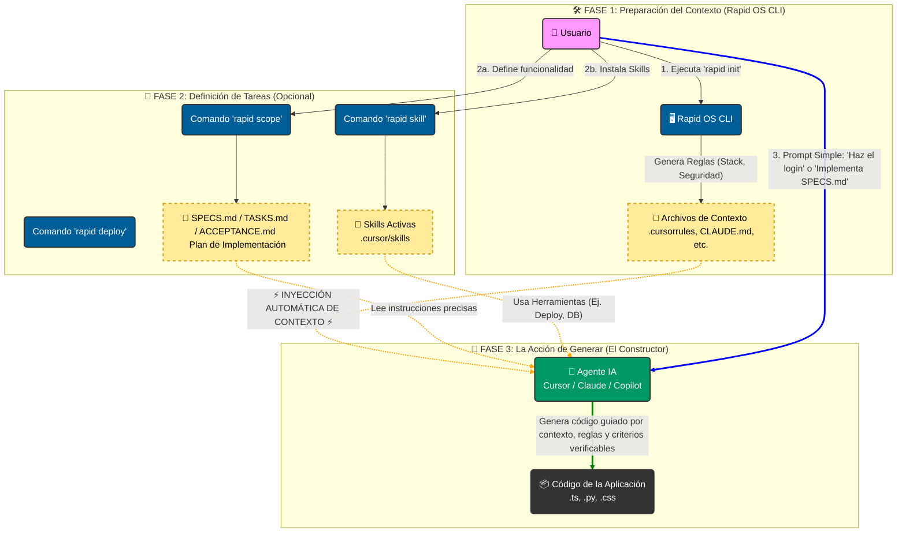

<a name="readme-top"></a>

<div align="center">

# ⚡ Rapid OS

### Context Injection for AI Engineering

Convierte a tus Agentes (Cursor, Claude, Antigravity, VS Code y Codex) en Ingenieros Senior instantáneamente.

</div>

<details>
  <summary>Table of Contents</summary>
  <ol>
    <li><a href="#about-the-project">📖 About the Project</a></li>
    <li><a href="#rapid-os-v2-status">Rapid OS v2 Status</a></li>
    <li><a href="#how-it-works">🧩 How it Works</a></li>
    <li>
      <a href="#build-with">⚒️ Build With</a>
      <ul>
        <li><a href="#tech-stack">Tech Stack</a></li>
        <li><a href="#key-features">Key Features</a></li>
      </ul>
    </li>
    <li>
      <a href="#getting-started">💻 Getting Started</a>
      <ul>
        <li><a href="#setup">Setup</a></li>
        <li><a href="#prerequisites">Prerequisites</a></li>
        <li><a href="#install">Install</a></li>
        <li><a href="#update">Update</a></li>
      </ul>
    </li>
    <li><a href="#usage">Usage</a></li>
    <li><a href="#run-tests">Run tests</a></li>
    <li><a href="#deployment">Deployment</a></li>
    <li><a href="#authors">👥 Authors</a></li>
    <li><a href="#future-features">Future v2.1+ Enhancements</a></li>
    <li><a href="#contributing">🤝 Contributing</a></li>
    <li><a href="#show-your-support">⭐ Show your Support</a></li>
    <li><a href="#acknowledgements">👏 Acknowledgements</a></li>
    <li><a href="#faq">❓ FAQ</a></li>
    <li><a href="#license">📃 License</a></li>
  </ol>
</details>

---

## 📖 About the Project <a name="about-the-project"></a>

**Rapid OS** es un framework de "Inyección de Contexto" diseñado para resolver el problema de la **"Amnesia de Contexto"** en los LLMs.

Cuando trabajas con asistentes de IA como Cursor, Claude o Copilot, a menudo olvidan tus reglas de negocio, tu stack tecnológico o tus protocolos de seguridad. Rapid OS soluciona esto inyectando una **"Constitución de Proyecto"** estandarizada que la IA debe obedecer antes de escribir una sola línea de código.

<p align="right">(<a href="#readme-top">back to top</a>)</p>

## Rapid OS v2 Status <a name="rapid-os-v2-status"></a>

Rapid OS v2 is complete. The repository now has the v2 architecture, CLI compatibility layer, agent adapter boundary, Codex support, structured scope artifacts, validation and diagnostics, project scanner, MCP abstraction, and automated test workflow in place.

Future work is tracked as post-v2 enhancement work. The v2 baseline keeps the existing command behavior and generated file locations stable.

| Workstream | Status | Included in v2 / v3 |
| :-- | :-- | :-- |
| Core package refactor | Complete | `rapid_os.cli`, `rapid_os.core`, and domain modules with `rapid.py` compatibility. |
| Agent adapter architecture | Complete | Cursor, Claude, Antigravity, VS Code, and Codex adapters behind a registry. |
| First-class Codex support | Complete | Opt-in `AGENTS.md` generation through the adapter system. |
| Structured scope generation | Complete | `SPECS.md`, `TASKS.md`, and `ACCEPTANCE.md` from `rapid scope`. |
| Validation and diagnostics | Complete | `rapid validate`, `rapid doctor`, and `rapid inspect-context` (including `RAPID6xx` snapshot and `RAPID8xx` spec registry checks). |
| Project Intelligence (v3 Phase 1) | Complete | Deterministic `ProjectModel`, `ProjectFact`, `Evidence` provenance, `rapid scan` (`--json`, `--write`, `--verbose`), and optional `.rapid-os/project.json` snapshot. |
| Context Compiler (v3 Phase 2) | Complete | Task-aware `ContextCompiler`, `ContextResolver`, `ContextManifest`, budget enforcement, conflict detection, `RAPID7xx` diagnostics, and read-only `rapid context` (`--mode`, `--harness`, `--objective`, `--spec`, `--spec-revision`, `--max-chars`, `--manifest`, `--json`). |
| Spec Registry (v3 Phase 3) | Complete | Canonical `SpecRecord` & `SpecRevision`, immutable revisions under `.rapid-os/specs/<id>/`, `rapid spec` (`create`, `list`, `show`, `revise`, `status`, `export-legacy`), `RAPID8xx` validation, and `rapid context --spec` integration. |
| Execution Policy Engine & Run Contract (v3 Phase 4) | Complete | Deterministic `ExecutionPolicy`, `PolicyDecision`, `ExecutionContract`, immutable `RunRecord` & `RunState` ledger under `.rapid-os/runs/<run-id>/`, `rapid policy` (`show`, `init`), `rapid run` (`create`, `list`, `show`, `status`, `task`, `gate`), and `RAPID1000–RAPID1014` validation. |
| Harness Capability Registry (v3 Phase 5) | Complete | Canonical capability catalog, conservative builtin & project `HarnessProfile` overrides (`.rapid-os/harnesses/<id>.json`), deterministic `CapabilityRequirementResolver` & `CapabilityResolver`, `.rapid-os/capabilities.lock`, `rapid harness` (`list`, `show`, `init`, `lock`, `resolve`), and `RAPID1100–RAPID1112` validation. |
| Evidence Engine & Behavioral Evals (v3 Phase 6) | Current | Immutable `RunEvidence` records & copied SHA-256-verified artifacts (`.rapid-os/evidence/<run-id>/`), deterministic `BehavioralEvaluator` & append-only `EvaluationReport` ledger (`.rapid-os/evals/<run-id>/`), `rapid evidence` (`list`, `show`, `add`, `verify`), `rapid eval` (`run`, `list`, `show`), and `RAPID1200–RAPID1229` validation. |
| MCP abstraction | Complete | Structured MCP model with editor-specific rendering and package metadata. |
| Testing and CI hardening | Complete | GitHub Actions plus `python -m unittest discover` and CLI smoke checks. |

<p align="right">(<a href="#readme-top">back to top</a>)</p>

## 🧩 How it Works <a name="how-it-works"></a>

Rapid OS actúa como el **Arquitecto** que define las reglas, mientras tu IA (Cursor/Claude) actúa como el **Constructor**.


```mermaid
graph TD
    %% Estilos
    classDef user fill:#f9f,stroke:#333,stroke-width:2px,color:black;
    classDef rapid fill:#005f99,stroke:#333,stroke-width:2px,color:white;
    classDef context fill:#ffeb99,stroke:#d4a017,stroke-width:2px,stroke-dasharray: 5 5,color:black;
    classDef ai fill:#009966,stroke:#333,stroke-width:2px,color:white;
    classDef code fill:#333,stroke:#333,stroke-width:2px,color:white;

    %% Nodos Principales
    User(👤 Usuario):::user
    AI(🤖 Agente IA <br> Cursor / Claude / Copilot):::ai
    FinalCode(📦 Código de la Aplicación <br> .ts, .py, .css):::code

    %% Subgrafo: Rapid OS (El Director Técnico)
    subgraph "🛠️ FASE 1: Preparación del Contexto (Rapid OS CLI)"
        RapidCLI(🖥️ Rapid OS CLI):::rapid

        User -->|1. Ejecuta 'rapid init'| RapidCLI

        ContextFiles[📄 Archivos de Contexto <br> .cursorrules, CLAUDE.md, etc.]:::context
        RapidCLI -->|"Genera Reglas (Stack, Seguridad)"| ContextFiles
    end

    %% Subgrafo: Tareas Específicas (Opcional)
    subgraph "🎯 FASE 2: Definición de Tareas (Opcional)"
        ScopeCmd(Comando 'rapid scope'):::rapid
        DeployCmd(Comando 'rapid deploy'):::rapid
        SkillCmd(Comando 'rapid skill'):::rapid

        User -->|2a. Define funcionalidad| ScopeCmd
        User -->|2b. Instala Skills| SkillCmd

        SpecsFile[📄 SPECS.md / TASKS.md / ACCEPTANCE.md <br> Plan de Implementación]:::context
        SkillsFolder[📂 Skills Activas <br> .cursor/skills]:::context

        ScopeCmd --> SpecsFile
        SkillCmd --> SkillsFolder
    end

    %% Subgrafo: La Generación Real (El Constructor)
    subgraph "🚀 FASE 3: La Acción de Generar (El Constructor)"
        %% La Inyección Mágica
        ContextFiles -.->|"⚡ INYECCIÓN AUTOMÁTICA DE CONTEXTO ⚡"| AI
        SpecsFile -.->|"Lee instrucciones precisas"| AI
        SkillsFolder -.->|"Usa Herramientas (Ej. Deploy, DB)"| AI

        %% La Acción del Usuario - CORREGIDA
        User == "3. Prompt Simple: 'Haz el login' o 'Implementa SPECS.md'" ==> AI

        %% El Resultado
        AI ==>|"Genera código guiado por contexto, reglas y criterios verificables"| FinalCode
    end

    %% Leyenda
    linkStyle 6,7,8 stroke:orange,stroke-width:2px,fill:none;
    linkStyle 9 stroke:blue,stroke-width:3px,fill:none;
    linkStyle 10 stroke:green,stroke-width:3px,fill:none;
```

<p align="right">(<a href="#readme-top">back to top</a>)</p>

## ⚒️ Build With <a name="build-with"></a>

### Tech Stack <a name="tech-stack"></a>

Este proyecto está construido utilizando tecnologías nativas para asegurar máxima compatibilidad y cero dependencias pesadas:

- **Core Logic**
- **Installer (Linux/Mac)**
- **Installer (Windows)**
- **Templates & Context**

### Key Features <a name="key-features"></a>

- **🧰 Gestor de Skills Híbrido**: Instala capacidades activas para tu IA desde dos fuentes:
  - _Remoto_: Acceso directo al ecosistema de la comunidad (`npx skills`) para instalar miles de herramientas.
  - _Local_: Usa tus propios templates privados (`templates/skills`) para estandarizar flujos de tu equipo.
- **🤖 Multi-Agente Modular**: No más ruido. Elige exactamente qué archivos de configuración generar: Cursor (`.cursorrules`), Claude Code (`CLAUDE.md`), Google Antigravity (`.agent/rules`), VS Code (`INSTRUCTIONS.md`) o Codex (`AGENTS.md`). La generación usa adaptadores internos para mantener cada agente aislado y listo para crecer sin cambiar tus comandos.
- **🧠 Contexto de Negocio Inteligente**: Importa tus reglas de negocio desde archivos Markdown (`.md`) existentes o guárdalas como Plantillas reutilizables para futuros proyectos.
- **🏗️ Topologías Arquitectónicas**: Define si tu proyecto es Frontend Only, BaaS (Supabase), Fullstack Separado o **Sitio de Documentación** para evitar alucinaciones de código.
- **🔌 Herramientas MCP (Model Context Protocol)**: Configura automáticamente servidores de base de datos (Postgres/Supabase) y herramientas de investigación (Context7, Firecrawl).
- **🖼️ Contexto de Referencia Visual (Vision)**: Registra capturas de pantalla en `references/` junto con una descripción humana en `references/VISION_CONTEXT.md` y reensambla el contexto de agentes.
- **🚀 Stacks Senior**: Templates pre-configurados para Web Moderno, Python AI, Creative Frontend, **Docusaurus Docs**, etc.
- **🛡️ Seguridad por Defecto**: Inyección automática de protocolos OWASP y reglas Anti-PII.
- **☁️ Guías de Despliegue (`DEPLOY.md`)**: Genera instrucciones y contexto de despliegue en `DEPLOY.md` a partir de templates locales (`templates/deploy/<target>.md`, con template incluido actualmente para `aws`; otros nombres válidos generan una guía genérica fallback `Deploy to <target>`).

<p align="right">(<a href="#readme-top">back to top</a>)</p>

## 💻 Getting Started <a name="getting-started"></a>

Sigue estos pasos para instalar Rapid OS en tu entorno local.

### Setup <a name="setup"></a>

No necesitas clonar este repositorio manualmente para usar la herramienta. El instalador se encargará de todo.

### Prerequisites <a name="prerequisites"></a>

Asegúrate de tener instalado:

- **Git**: Para control de versiones.
- **Python 3.10+**: Para ejecutar el núcleo de Rapid OS.
- **Node.js (Opcional)**: Requerido solo si deseas instalar Skills remotas usando `npx`.

### Install <a name="install"></a>

#### Opción A: Linux, macOS o WSL

```bash
curl -sL https://raw.githubusercontent.com/alyconr/Rapid-OS/main/install.sh | bash
```

#### Opción B: Windows (PowerShell Nativo)

```powershell
irm https://raw.githubusercontent.com/alyconr/Rapid-OS/main/install.ps1 | iex
```

Reinicia tu terminal después de la instalación para cargar el comando `rapid`.

<p align="right">(<a href="#readme-top">back to top</a>)</p>

### Update <a name="update"></a>

Cuando Rapid OS implemente nuevas funcionalidades, actualiza la copia instalada antes de usar los comandos nuevos.

#### Windows PowerShell

```powershell
git -C $HOME\.rapid-os pull origin main
```

Si prefieres reinstalar desde el instalador remoto:

```powershell
irm https://raw.githubusercontent.com/alyconr/Rapid-OS/main/install.ps1 | iex
```

#### Linux, macOS o WSL

```bash
git -C "$HOME/.rapid-os" pull origin main
```

Si prefieres reinstalar desde el instalador remoto:

```bash
curl -sL https://raw.githubusercontent.com/alyconr/Rapid-OS/main/install.sh | bash
```

#### Desde un checkout local de desarrollo

Si ejecutas Rapid OS directamente desde este repositorio, solo necesitas traer la rama principal:

```powershell
git pull origin main
```

Luego valida que la herramienta quedó disponible:

```powershell
rapid doctor
```

Si el comando global `rapid` sigue apuntando a una versión antigua, actualiza la copia instalada en `$HOME\.rapid-os` con el comando de PowerShell anterior.

<p align="right">(<a href="#readme-top">back to top</a>)</p>

## Usage <a name="usage"></a>

### 1. Inicializar Proyecto (Nuevo o Legacy)

`rapid init` es el comando universal. Úsalo tanto para proyectos desde cero como para "curar" proyectos existentes con **Amnesia de Contexto**.

1.  Abre tu terminal en la **raíz de tu proyecto**.
2.  Ejecuta:
    ```bash
    rapid init
    ```
3.  Sigue el asistente interactivo:
    - **Scanner seguro**: Rapid OS revisa señales locales como `package.json`, `tsconfig.json`, Docker, tests, monorepo, base de datos y provider de deploy para sugerir stack/topología. Nada se aplica sin confirmación.
    - **Tech Stack**: Define las tecnologías permitidas (ej. "Solo React Functional Components").
    - **Arquetipo**: "Corporate" para código estricto con tests, o "MVP" para velocidad.
    - **Reglas de Negocio**: Importa tus documentos existentes o extráelos de tu cabeza.
    - **Capacidades de Investigación**: Activa `Context7` (Docs) y `Firecrawl` (Web Scraping) para que tu IA pueda investigar librerías y sitios web por sí misma.
    - **Documentación opcional**: Al final puedes crear scaffolding starter en `docs/` para `BUSINESS_RULES.md`, `SPECS.md`, `USER_STORIES.md` y `DATA_MODEL.md`. Cada archivo se confirma por separado y crea backup antes de sobrescribir.

> **Para Refactorización**: Al ejecutar esto en un proyecto legacy, Rapid OS inyectará un archivo `.cursorrules` o `.agent` que obligará a la IA a respetar los nuevos estándares en cualquier refactorización futura, evitando que imite el código antiguo ("code drift").

Para conservar el flujo manual anterior, usa:

```bash
rapid init --no-scan
```

Si pasas `--stack`, ese valor manda sobre cualquier sugerencia del scanner:

```bash
rapid init --stack web-modern
```

También puedes fijar el arquetipo directamente por CLI (`mvp` o `corporate`) sin pregunta interactiva:

```bash
rapid init --archetype corporate
rapid init --archetype mvp
```

### 2. Refinamiento de Reglas (Rapid Refine)

Si sientes que tu Agente (Cursor/Claude) ignora tus reglas o las malinterpreta, usa `rapid refine` para mejorar la documentación con ayuda de la IA.

1.  Identifica el archivo de reglas problemático (ej. `standards/business.md`).
2.  Ejecuta:
    ```bash
    rapid refine .rapid-os/standards/business.md
    ```
3.  **Copia el Mega-Prompt** que aparecerá en tu terminal.
4.  **Pégalo en tu Chat** con la IA.
5.  La IA te devolverá una versión profesional y sin ambigüedades de tus reglas. Reemplaza el contenido del archivo con esta nueva versión.

### 3. Instalar Skills (Capacidades Activas)

Dota a tu agente de herramientas para ejecutar tareas complejas (ej. consultar bases de datos, navegar web).

```bash
# Opción A: Desde el Marketplace (Vercel)
rapid skill add vercel-labs/agent-skills

# Opción B: Templates Privados de tu equipo
rapid skill install mi-workflow-interno
```

Si ejecutas `rapid skill` sin argumentos, Rapid OS abre un menú interactivo para listar, instalar un template local, agregar una skill remota o salir sin cambios.

### 4. Definir Scope y Refactorizaciones

Evita darle instrucciones vagas a la IA como _"Mejora el código"_. Usa el **Asistente de Alcance**.

```bash
rapid scope
```

- Selecciona el modo: **new feature**, **refactor**, **bugfix** o **legacy hardening**.
- Responde preguntas de negocio, alcance, actores, flujo, casos borde, reglas, restricciones, impacto en datos, criterios de aceptación, pruebas y tareas.
- Rapid OS generará `SPECS.md`, `TASKS.md` y `ACCEPTANCE.md` optimizados para implementación guiada por specs.
- **Tu Prompt Final**: _"Implementa el plan detallado en SPECS.md paso a paso y valida contra ACCEPTANCE.md."_

### 5. Configurar Herramientas de Base de Datos (MCP)

Si tu arquitectura incluye base de datos, genera los drivers para que la IA pueda ejecutar SQL real y ver tablas:

```bash
rapid mcp --ide claude --scope project
```

(Soporta Postgres y Supabase automáticamente).

Ejemplos adicionales:

```bash
rapid mcp --ide codex --scope project
rapid mcp --ide codex --scope global
rapid mcp --ide claude --scope global
rapid mcp --ide cursor --scope project
rapid mcp --ide vscode --scope project
rapid mcp --ide antigravity --scope global
```

Rapid OS modela los servidores MCP internamente y luego renderiza el formato específico de cada editor:

- Codex -> `.codex/config.toml` con bloques `mcp_servers`
- Claude -> `.mcp.json` o `~/.claude.json` con `mcpServers`
- Cursor -> `.cursor/mcp.json` o `~/.cursor/mcp.json` con `mcpServers`
- VS Code -> `.vscode/mcp.json` con `servers`
- Antigravity -> `~/.gemini/antigravity/mcp_config.json` con una estructura JSON conservadora basada en `mcpServers`

Si el proyecto aún no fue inicializado con `rapid init`, `rapid mcp` ofrece crear solo la estructura mínima necesaria para generar MCP o cancelar sin escribir archivos.

Si omites `--ide` o `--scope`, Rapid OS entra en modo interactivo y te deja elegir destino y alcance antes de escribir el archivo.

### 6. Contexto de Referencia Visual (Vision)

Registra una referencia visual del proyecto para acompañar tus reglas con contexto de interfaz:

```bash
rapid vision ruta/al/diseño.png
```

`rapid vision` copia la imagen dentro de `references/`, solicita una descripción humana del diseño, agrega la entrada a `references/VISION_CONTEXT.md` y regenera los archivos de contexto de los agentes configurados. Si ejecutas `rapid vision` sin ruta, el comando pide el path de forma interactiva y permite cancelar con `0`, `q`, `quit`, `exit`, `salir` o `cancelar`.

### 7. Documentación con Docusaurus

Rapid OS incluye un stack especializado para crear sitios de documentación modernos:

```bash
rapid init
# Selecciona:
# Stack: docs-modern
# Topology: doc-site
```

**Incluye:**

- **Framework**: Docusaurus 3+ (Static Site Generator).
- **Lenguaje**: TypeScript y MDX (Markdown con componentes React).
- **Diagramas**: Soporte nativo para Mermaid.js (Diagramas de flujo, secuencia, GANTT).
- **Búsqueda**: Configuración lista para Algolia DocSearch o búsqueda local.
- **Versionado**: Estructura de carpetas optimizada para versionado semántico de documentación.
- **Topología**: `doc-site` organiza tu proyecto con carpetas específicas para `docs`, `blog`, `src/components` y `static` assets.

### 🧩 Estándares Universales (business.md)

Rapid OS incluye por defecto un **Meta-Framework de Negocio** (`.rapid-os/standards/business.md`) que actúa como la "Constitución" de tu proyecto.

Este archivo ya no es solo para Rapid OS; es una guía universal que define:

- **Axiomas de Valor**: Qué problema resuelves y por qué te deben comprar.
- **Funnel Universal**: Cómo adquieres, activas y retienes clientes.
- **Modelo de Negocio**: Definición clara de cómo generas ingresos (SaaS, E-com, etc.).

> **Tip**: Puedes editar este archivo para adaptarlo a tu nicho, pero mantén la estructura para que la IA entienda tus prioridades.

### 🔄 Cómo Actualizar tus Reglas de Negocio

Si necesitas modificar tus reglas existentes, tienes dos caminos desde la CLI:

1.  **Opción A: `rapid refine` (Recomendada para Mejorar)**
    Si ya tienes reglas pero quieres que la IA las profesionalice y elimine ambigüedades:

    ```bash
    rapid refine .rapid-os/standards/business.md
    ```

    _Genera un prompt para que tu IA reescriba las reglas con nivel Senior._

2.  **Opción B: `rapid init` (Para Re-importar o Cambiar)**
    Si quieres importar un archivo nuevo o reescribirlas desde cero:
    ```bash
    rapid init
    ```
    _Al llegar a la sección de Negocio, selecciona importar un nuevo `.txt`/`.md` o escribir nuevas reglas manuales. Esto sobrescribirá el archivo actual._

---

## ⚡ CLI Command Reference <a name="cli-reference"></a>

Tabla completa de comandos disponibles en Rapid OS y sus resultados.

| Comando                      | Descripción                                                                                     | Resultado / Output                                                                                |
| :--------------------------- | :---------------------------------------------------------------------------------------------- | :------------------------------------------------------------------------------------------------ |
| `rapid init`                 | **Inicializa Rapid OS**. Escanea señales locales y sugiere stack/topología con confirmación.   | Crea `.cursorrules`, `.agent/rules`, `.rapid-os/` y puede crear docs opcionales con backups. Soporta `--no-scan`, `--stack` y `--archetype {mvp,corporate}`. |
| `rapid scan`                 | **Project Intelligence**. Escanea el repositorio y construye el `ProjectModel` determinista con evidencia trazable. | Read-only por defecto. Soporta `--verbose` (muestra evidencia), `--json` (JSON puro en stdout) y `--write` (persiste `.rapid-os/project.json` con backup). |
| `rapid context`              | **Context Compiler**. Compila contexto selectivo y trazable por tarea, modo, spec, harness y presupuesto. | Read-only. Soporta `--mode`, `--harness`, `--objective`, `--spec`, `--spec-revision`, `--max-chars`, `--manifest` y `--json`. |
| `rapid spec`                 | **Spec Registry (v3)**. Gestiona especificaciones con identidad estable, revisiones inmutables y estado (`draft`, `ready`, `archived`). | Subcomandos: `create`, `list`, `show`, `revise`, `status` y `export-legacy`. Persiste bajo `.rapid-os/specs/<spec-id>/`. |
| `rapid policy`               | **Execution Policy (v3)**. Inspecciona la política de ejecución efectiva o inicializa `.rapid-os/policy.json`. | Subcomandos: `show [--json]` (read-only) e `init [--json]`. |
| `rapid run`                  | **Run Registry & Execution Contracts (v3)**. Crea y gobierna contratos de ejecución inmutables e historial de estados de ejecución declarada. | Subcomandos: `create`, `list`, `show`, `status`, `task` y `gate`. Persiste bajo `.rapid-os/runs/<run-id>/`. |
| `rapid harness`              | **Harness Capability Registry (v3)**. Inspecciona perfiles de capacidades de harnesses, inicializa overrides de proyecto, genera `.rapid-os/capabilities.lock` y resuelve compatibilidad declarada contra un `ExecutionContract`. | Subcomandos: `list`, `show`, `init`, `lock` y `resolve` (`--run`, `--locked`, `--require`, `--require-compatible`, `--json`). |
| `rapid evidence`             | **Evidence Engine (v3)**. Registra, lista, inspecciona y verifica evidencias inmutables de ejecución (`RunEvidence`) y artefactos copiados con verificación SHA-256. | Subcomandos: `list`, `show`, `add` (`--run`, `--input`, `--json`) y `verify`. Persiste bajo `.rapid-os/evidence/<run-id>/`. |
| `rapid eval`                 | **Behavioral Evals (v3)**. Evalúa determinísticamente contratos de ejecución, estados de Run, evidencias y capacidades observables (`EvaluationReport`). | Subcomandos: `run` (`--run`, `--require`, `--write`, `--require-pass`, `--json`), `list` y `show`. Persiste bajo `.rapid-os/evals/<run-id>/`. |
| `rapid scope`                | **Asistente de Alcance (Legacy Compatible)**. Te entrevista para definir una feature, refactor, bugfix o hardening. | Genera `SPECS.md`, `TASKS.md` y `ACCEPTANCE.md` con backups. Con `--register` también registra la spec en `.rapid-os/specs/`. |
| `rapid refine <file>`        | **Refinamiento de Reglas**. Mejora cualquier documento de reglas usando IA.                     | Genera un Mega-Prompt para que pegues en tu chat y la IA reescriba el archivo profesionalmente.   |
| `rapid skill [action] [name]` | **Instala o lista Skills** desde menú interactivo, registro comunitario o template privado.     | Sin argumentos abre menú; con `add`/`install` conserva el flujo directo existente.                 |
| `rapid mcp [--ide ... --scope ...]` | **Configura MCP Servers**. Modela filesystem, BD y research tools.                    | Escribe el archivo MCP propio de cada editor con backup previo; si faltan flags entra en modo interactivo. |
| `rapid vision [image_path]`  | **Contexto de Referencia Visual**. Copia una imagen de referencia y documenta su descripción.   | Copia la imagen a `references/`, registra la descripción en `references/VISION_CONTEXT.md` y actualiza el contexto de agentes. |
| `rapid deploy <target>`      | **Guía de Despliegue**. Genera instrucciones de despliegue basadas en templates locales.        | Crea `DEPLOY.md` desde `templates/deploy/<target>.md` (template incluido: `aws`, o guía genérica fallback `Deploy to <target>`) con backup previo. |
| `rapid validate`             | **Validación de Proyecto**. Revisa templates, estándares, config, snapshots, specs, policy, runs, harnesses, capabilities.lock, evidence, evals, herramientas y contexto. | No escribe archivos. Sale con `0` si no hay errores y `1` si encuentra errores de validación.     |
| `rapid doctor`               | **Diagnóstico Local**. Revisa rutas resueltas, templates, Node/npx opcional y proyecto actual.  | No escribe archivos. Usa advertencias para capacidades opcionales como Node/npx.                  |
| `rapid inspect-context`      | **Inspección de Contexto**. Ensambla y previsualiza el contexto final antes de generar archivos. | No escribe archivos. Muestra secciones incluidas, herramientas seleccionadas y preview final.     |

---

### Project Intelligence (`rapid scan`)

Puedes inspeccionar qué hechos detecta Rapid OS sobre tu repositorio (lenguajes, frameworks, gestores de paquetes, Docker, testing, monorepo, bases de datos y proveedores de deploy) sin modificar ningún archivo:

```bash
rapid scan
rapid scan --verbose
rapid scan --json
```

Si deseas persistir un snapshot determinista y trazable del `ProjectModel` (`schema_version: 1`) en `.rapid-os/project.json`:

```bash
rapid scan --write
rapid scan --json --write
```

### Spec Registry (`rapid spec`)

El **Spec Registry** de Rapid OS v3 reemplaza los archivos singleton sobrescribibles por un registro estructurado en `.rapid-os/specs/<spec-id>/` con identidad estable (`spec.json`), ciclo de vida (`draft`, `ready`, `archived`) y revisiones inmutables (`revisions/0001/`, `0002/`, ... con `revision.json`, `requirements.md`, `tasks.md` y `acceptance.md`):

```bash
# Crear una spec (interactivo o por flags)
rapid spec create --title "Booking Idempotency" --mode feature --objective "Prevent duplicate charges" --problem "Retries duplicate bookings" --scope "POST /bookings" --acceptance "Duplicate key returns 200" --task "Add idempotency key store"

# Listar y consultar specs (read-only)
rapid spec list
rapid spec list --json
rapid spec show booking-idempotency
rapid spec show booking-idempotency --revision 1 --json

# Crear una nueva revisión inmutable (hereda campos no especificados)
rapid spec revise booking-idempotency --acceptance "Duplicate key returns 200" --acceptance "Timeout retries are safe"

# Marcar como lista para consumo del Context Compiler
rapid spec status booking-idempotency ready

# Exportar explícitamente a SPECS.md / TASKS.md / ACCEPTANCE.md (compatibilidad v2)
rapid spec export-legacy booking-idempotency
```

> **Compatibilidad con `rapid scope`**: `rapid scope` conserva su comportamiento clásico escribiendo `SPECS.md`, `TASKS.md` y `ACCEPTANCE.md` en la raíz, y soporta `rapid scope --register [--spec-id <id>] [--status {draft,ready}]` para registrar simultáneamente la spec en `.rapid-os/specs/`.

### Context Compiler (`rapid context`)

El **Context Compiler** de Rapid OS v3 selecciona y compila únicamente el contexto relevante para una tarea concreta combinando `ProjectModel`, estándares del proyecto, specs `ready` del Spec Registry, precedencia determinista, detección de conflictos y presupuesto de caracteres (`max_chars`):

```bash
rapid context
rapid context --mode bugfix --harness codex
rapid context --mode feature --spec booking-idempotency
rapid context --mode feature --spec booking-idempotency --spec-revision 1
rapid context --mode feature --objective "Implement order API" --max-chars 16000
rapid context --manifest
rapid context --json
```

- **Read-only**: `rapid context` nunca escribe ni modifica archivos en el repositorio.
- **`--spec <spec-id>`**: Carga `requirements.md`, `tasks.md` y `acceptance.md` de una spec en estado `ready` desde `.rapid-os/specs/<spec-id>/` (y excluye los singletons raíz `SPECS.md`/`TASKS.md`/`ACCEPTANCE.md` para evitar ambigüedad).
- **`--manifest`**: Muestra qué fuentes se seleccionaron (`SELECTED`), cuáles se omitieron (`SKIPPED` y por qué) y cualquier conflicto detectado (`CONFLICTS`).
- **`--json`**: Emite el documento `CompiledContext` (`schema_version: 1`, `manifest` y `content`) listo para consumo automatizado.

### Execution Policy Engine & Run Contracts (`rapid policy` & `rapid run`)

La **Fase 4** de Rapid OS v3 introduce gobernanza determinista de ejecución vinculando cada intento concreto (`Run`) a una revisión exacta e inmutable de Spec (`ready`), un snapshot exacto de `CompiledContext`, el `ProjectModel` y la `ExecutionPolicy` vigente:

```bash
# Inspeccionar o inicializar .rapid-os/policy.json
rapid policy show
rapid policy show --json
rapid policy init

# Crear un Run vinculado a una Spec ready
rapid run create --spec booking-idempotency --harness codex
rapid run create --spec booking-idempotency --spec-revision 1 --risk high --json

# Listar e inspeccionar Runs (read-only)
rapid run list
rapid run list --status prepared --json
rapid run show booking-idempotency-r1-run-001
rapid run show booking-idempotency-r1-run-001 --json

# Atender gates pre-ejecución y activar el Run
rapid run gate booking-idempotency-r1-run-001 gate.baseline acknowledge --reason "Baseline green"
rapid run status booking-idempotency-r1-run-001 active

# Actualizar ledger de tareas (T001, T002, ...)
rapid run task booking-idempotency-r1-run-001 T001 in_progress
rapid run task booking-idempotency-r1-run-001 T001 done

# Atender/waive gates post-ejecución y declarar el Run como finished
rapid run gate booking-idempotency-r1-run-001 gate.tests acknowledge --reason "Unit tests added"
rapid run gate booking-idempotency-r1-run-001 gate.final-verification acknowledge --reason "Ready for verification"
rapid run status booking-idempotency-r1-run-001 finished
```

### Harness Capability Registry (`rapid harness`)

La **Fase 5** de Rapid OS v3 introduce un registro determinista y declarativo de capacidades de harnesses (`HarnessProfile`) y un resolvedor de compatibilidad (`CapabilityResolver`) frente a los requisitos derivados de cada `ExecutionContract`:

```bash
# Listar perfiles activos (built-in + overrides/perfiles de proyecto en .rapid-os/harnesses/)
rapid harness list
rapid harness list --json

# Inspeccionar un perfil activo (read-only)
rapid harness show codex
rapid harness show codex --json

# Inicializar un override de proyecto editable (.rapid-os/harnesses/codex.json) desde el built-in
rapid harness init codex
rapid harness init codex --json

# Generar snapshot determinista de todos los perfiles activos en .rapid-os/capabilities.lock
rapid harness lock
rapid harness lock --json

# Resolver compatibilidad declarada contra el ExecutionContract de un Run (read-only; evalúa contract.harness y nunca muta el Run)
rapid harness resolve --run booking-idempotency-r1-run-001
rapid harness resolve --run booking-idempotency-r1-run-001 --json
rapid harness resolve --run booking-idempotency-r1-run-001 --require mcp.invoke --require shell.execute
rapid harness resolve --run booking-idempotency-r1-run-001 --locked --require-compatible
```

- **Fuente de verdad del harness**: `rapid harness resolve` evalúa exclusivamente `ExecutionContract.harness` (`profile.id == contract.harness`). El harness se selecciona al crear el Run (`rapid run create --harness <id>`); `validate_harness_id()` valida el ID canónico (`RAPID1104` `HarnessIdentityError`).
- **Derivación determinista de requisitos (`CapabilityRequirementResolver`)**:
  - **Siempre**: `context.consume` (`source="contract.context"`), `repository.read` (`source="contract.repository"`).
  - **Si `contract.tasks` no está vacío**: `repository.write` (`source="contract.tasks"`).
  - **Workspace (`contract.workspace`)**: `current_allowed` → `workspace.current` (`source="contract.workspace"`), `isolated_required` → `workspace.isolated` (`source="contract.workspace"`).
  - **Required `gate.tests`**: `tests.execute` (`source="contract.gate.tests"`).
  - **Gates humanos/de gobernanza**: No derivan capacidades técnicas del harness.
  - **`--require <capability-id>` explícitos**: Estrictamente aditivos (`source="cli.require"`); nunca eliminan, degradan ni reemplazan requisitos derivados del contrato.
- **Códigos de diagnóstico (`RAPID1100–RAPID1119`)**:
  - `RAPID1100` (`INFO`): Harness capability registry / lock valid.
  - `RAPID1101` (`ERROR`): Invalid or unknown `capability_id` (`InvalidCapabilityIdError`).
  - `RAPID1102` (`ERROR`): Invalid `HarnessProfile` schema/content/digest (`InvalidHarnessProfileError`).
  - `RAPID1103` (`ERROR`): `HarnessProfile` not found (`HarnessProfileNotFoundError`).
  - `RAPID1104` (`ERROR`): Invalid harness identity / filename-ID mismatch (`HarnessIdentityError`).
  - `RAPID1105` (`ERROR`): Unsafe profile/registry/lock path or symlink (`UnsafeHarnessPathError`).
  - `RAPID1106` (`ERROR`): Invalid capability support declaration (`InvalidCapabilitySupportError`).
  - `RAPID1107` (`ERROR`): Invalid `CapabilityRequirement` (`InvalidCapabilityRequirementError`).
  - `RAPID1108` (`ERROR`): Invalid `CapabilityResolution` (`InvalidCapabilityResolutionError`).
  - `RAPID1109` (`ERROR`): `CapabilityResolution` digest mismatch (`CapabilityResolutionDigestMismatchError`).
  - `RAPID1110` (`ERROR`): Strict compatibility requirement not satisfied (`IncompatibleHarnessError`; aplica tanto a `incompatible` como a `unresolved` bajo `--require-compatible`).
  - `RAPID1111` (`ERROR`): Invalid or missing `capabilities.lock` (`InvalidCapabilityLockError`).
  - `RAPID1112` (`WARNING`): `capabilities.lock` stale relative to active profiles.
  - `RAPID1113–RAPID1119`: Reservados.

```text
HarnessProfile
    DECLARES capabilities

CapabilityResolution
    DETERMINES declared compatibility

Neither proves runtime behavior.
```

### Evidence Engine & Behavioral Evals (`rapid evidence` & `rapid eval`)

La **Fase 6** de Rapid OS v3 cierra el bucle de gobernanza separando estrictamente **Declaración** (`GateDisposition.ACKNOWLEDGED`), **Capacidad** (`HarnessProfile`), **Observación** (`RunEvidence`) y **Juicio Determinista** (`BehavioralEvaluator` → `EvaluationReport`):

```bash
# Ingestar evidencia inmutable ligada a un Run y copiar artefactos verificados por SHA-256
rapid evidence add --run booking-idempotency-r1-run-001 --input evidence.json
rapid evidence add --run booking-idempotency-r1-run-001 --input evidence.json --json

# Listar, inspeccionar y verificar integridad de evidencias y artefactos (read-only)
rapid evidence list --run booking-idempotency-r1-run-001
rapid evidence list --run booking-idempotency-r1-run-001 --json
rapid evidence show --run booking-idempotency-r1-run-001 E001
rapid evidence show --run booking-idempotency-r1-run-001 E001 --json
rapid evidence verify --run booking-idempotency-r1-run-001
rapid evidence verify --run booking-idempotency-r1-run-001 --json

# Evaluar el comportamiento observado contra el contrato, estado y evidencias del Run
rapid eval run --run booking-idempotency-r1-run-001
rapid eval run --run booking-idempotency-r1-run-001 --json
rapid eval run --run booking-idempotency-r1-run-001 --require mcp.invoke
rapid eval run --run booking-idempotency-r1-run-001 --write
rapid eval run --run booking-idempotency-r1-run-001 --require-pass
rapid eval run --run booking-idempotency-r1-run-001 --write --require-pass --json

# Listar e inspeccionar reportes de evaluación persistidos (read-only)
rapid eval list --run booking-idempotency-r1-run-001
rapid eval list --run booking-idempotency-r1-run-001 --json
rapid eval show --run booking-idempotency-r1-run-001
rapid eval show --run booking-idempotency-r1-run-001 --revision 1 --json
```

- **Esquemas canónicos deterministas**:
  - `RunEvidence` (`schema_version = 1`): `id`, `run_id`, `contract_digest`, `state_revision`, `state_digest`, `kind`, `producer`, `summary`, `task_ids`, `gate_ids`, `capability_ids`, `payload` (ej. `command_result`: `{"label": "...", "exit_code": 0}`), `artifacts`, `content_digest` (sin `recorded_at`, garantizando digests deterministas).
  - `EvidenceArtifact`: `path`, `sha256`, `size_bytes`.
  - `EvaluationReport` (`schema_version = 1`): incluye `extra_capability_ids` (validados contra el catálogo de Fase 5, ordenados, deduplicados e incluidos en `report_digest`) y `EvaluationVerdict` (`pass`, `pass_with_waivers`, `fail`, `unverified`).
  - **Replay semántico obligatorio (`RAPID1223`)**: Todo `EvaluationReport` persistido se reconstruye con `BehavioralEvaluator` a partir de `ExecutionContract + RunState histórico + conjunto exacto de evidencias + BehavioralRuleset + extra_capability_ids`, exigiendo igualdad exacta de `assertions`, `verdict`, `ruleset_digest`, `evidence_set_digest`, `extra_capability_ids` y `report_digest`.
- **Aislamiento inmutable (Fase 4 y Fase 5 intactas)**: `rapid evidence` y `rapid eval` nunca modifican `.rapid-os/runs/<run-id>/` (`run.json`, `contract.json`, `context.md`, `context-manifest.json`, `states/*.json`), nunca auto-reconocen gates, nunca auto-finalizan Runs y nunca mutan `.rapid-os/harnesses/` ni `.rapid-os/capabilities.lock`.
- **`ACKNOWLEDGED` no implica `PASS`**: Un gate reconocido (`GateDisposition.ACKNOWLEDGED`) o una tarea marcada `DONE` sin evidencia verificada permanece en `UNVERIFIED`. Un gate con exención explícita (`WAIVED`) produce `WAIVED` y veredicto global `PASS_WITH_WAIVERS` (`pass_with_waivers`) cuando el resto de aserciones requeridas pasan.
- **Significado de `EvaluationVerdict.PASS` (`pass`)**: Indica que las reglas deterministas de evidencia de Fase 6 se cumplen para el conjunto exacto de evidencias registradas; **no** demuestra matemáticamente ausencia total de bugs, perfección de seguridad ni completitud de requisitos.
- **Autenticidad de evidencias**: El Evidence Registry verifica integridad local (`content_digest`, `sha256` de artefactos copiados, `size_bytes`, secuencia continua `E001..E00N` y vinculación a `run_id`, `contract_digest` y `RunState`), pero no proporciona atestación criptográfica externa de hardware o runtime remoto.
- **Códigos de diagnóstico (`RAPID1200–RAPID1239`)**:
  - `RAPID1200` (`INFO`): Evidence Registry valid.
  - `RAPID1201` (`ERROR`): Invalid evidence ID (`InvalidEvidenceIdError`).
  - `RAPID1202` (`ERROR`): Invalid `RunEvidence` schema or `content_digest` (`InvalidRunEvidenceError`).
  - `RAPID1203` (`ERROR`): Evidence Run / Contract / `RunState` / harness producer binding mismatch (`EvidenceBindingMismatchError`).
  - `RAPID1204` (`ERROR`): Unsafe evidence path or symlink (`UnsafeEvidencePathError`).
  - `RAPID1205` (`ERROR`): Evidence artifact missing, digest mismatch, or size mismatch (`EvidenceArtifactIntegrityError`).
  - `RAPID1206` (`ERROR`): Invalid `EvidenceKind` or payload (`InvalidEvidencePayloadError`).
  - `RAPID1207` (`ERROR`): Invalid task, gate, or capability reference (`InvalidEvidenceReferenceError`).
  - `RAPID1208` (`ERROR`): Evidence sequence gap or duplicate identity (`EvidenceSequenceGapError`, incluyendo cualquier record histórico faltante aunque su directorio `artifacts/E00K/` exista).
  - `RAPID1209` (`WARNING`): Trailing crash-orphan evidence artifact directory (`artifacts/E00N` sin `records/E00N.json` en `max_record_ordinal + 1`; bloquea de forma segura `rapid evidence add`).
  - `RAPID1210` (`ERROR`): Evidence not found (`EvidenceNotFoundError`).
  - `RAPID1211` (`ERROR`): Append-only evidence overwrite violation (`EvidenceOverwriteError`).
  - `RAPID1212–RAPID1219`: Reservados para Evidence.
  - `RAPID1220` (`INFO`): Eval Registry valid.
  - `RAPID1221` (`ERROR`): Invalid `EvaluationReport` schema (`InvalidEvaluationReportError`).
  - `RAPID1222` (`ERROR`): `EvaluationReport` digest mismatch (`EvaluationReportDigestMismatchError`).
  - `RAPID1223` (`ERROR`): Evaluation Run / state / evidence binding or semantic replay mismatch (`EvaluationBindingMismatchError`).
  - `RAPID1224` (`ERROR`): Unsafe eval path or symlink (`UnsafeEvaluationPathError`).
  - `RAPID1225` (`ERROR`): Evaluation `UNVERIFIED` when `--require-pass` (`EvaluationUnverifiedError`).
  - `RAPID1226` (`ERROR`): Evaluation `FAIL` when `--require-pass` (`EvaluationFailedError`).
  - `RAPID1227` (`WARNING`): Stored `EvaluationReport` is stale relative to current `RunState`, `evidence_set_digest`, or `ruleset_digest`.
  - `RAPID1228` (`ERROR`): `EvaluationReport` not found (`EvaluationReportNotFoundError`).
  - `RAPID1229` (`ERROR`): Append-only evaluation report overwrite violation (`EvaluationOverwriteError`).
  - `RAPID1230–RAPID1239`: Reservados para Evals.

```text
Phase 4 RunState
    DECLARES lifecycle and gate disposition

Phase 5 CapabilityResolution
    EVALUATES declared harness capability compatibility

Phase 6 RunEvidence
    RECORDS immutable observations and artifact digests

Phase 6 EvaluationReport
    DERIVES deterministic behavioral conclusions
```


### Validación y Diagnósticos

Antes de regenerar contexto o usar Rapid OS en CI, puedes validar el estado del proyecto:

```bash
rapid validate
rapid validate --json
rapid validate --strict
```

`rapid validate` falla con código `1` cuando hay errores, como `tech-stack.md` o `topology.md` faltantes, JSON inválido en `.rapid-os/config.json`, `.rapid-os/project.json`, `.rapid-os/specs/` (`RAPID801–RAPID809`), `.rapid-os/policy.json` o `.rapid-os/runs/` (`RAPID1001–RAPID1014`), `.rapid-os/harnesses/` o `.rapid-os/capabilities.lock` (`RAPID1101–RAPID1112`), `.rapid-os/evidence/` (`RAPID1201–RAPID1211`), `.rapid-os/evals/` (`RAPID1221–RAPID1229`), templates MCP, herramientas desconocidas en `.rapid-os/config.json`, combinaciones stack/topología incompatibles o contexto ensamblado vacío. Con `--strict`, las advertencias también devuelven `1`.

Para revisar la instalación local sin modificar nada:

```bash
rapid doctor
rapid doctor --json
```

`rapid doctor` reporta rutas resueltas, directorio de templates activo, estado del proyecto actual (incluyendo `.rapid-os/project.json`, `.rapid-os/specs/`, `.rapid-os/policy.json`, `.rapid-os/runs/`, `.rapid-os/harnesses/`, `.rapid-os/capabilities.lock`, `.rapid-os/evidence/` y `.rapid-os/evals/` si existen) y disponibilidad opcional de Node/npx.

Para ver el contexto final antes de escribir archivos de agente:

```bash
rapid inspect-context
rapid inspect-context --summary
rapid inspect-context --json
```

`rapid inspect-context` usa el mismo ensamblado de contexto que la generación normal, pero no escribe `.cursorrules`, `CLAUDE.md`, `INSTRUCTIONS.md`, `AGENTS.md` ni archivos de Antigravity.

---

## ✅ Capacidades y Limitaciones

```text
Rapid OS DOES:
- scan repository facts with evidence
- compile task-specific context with provenance and budgets
- manage immutable specs and revisions
- classify execution risk and produce immutable execution contracts
- track append-only run state
- resolve declared harness capability compatibility
- store immutable run evidence and verify artifact digests
- evaluate runs deterministically against evidence rules

Rapid OS DOES NOT:
- launch coding agents
- execute shell commands for runs
- run tests automatically
- create git worktrees automatically
- cryptographically attest external producer identity
- guarantee software correctness beyond recorded evidence rules
```

Lo que Rapid OS **ES** y lo que **NO ES**:

| LO QUE PUEDES HACER (Do's)                                                         | LO QUE NO HACE (Don'ts)                                                                              |
| :--------------------------------------------------------------------------------- | :--------------------------------------------------------------------------------------------------- |
| **Inyectar Contexto Senior**: Obligar a la IA a seguir Clean Architecture y SOLID. | **Escribir código por sí solo**: Rapid OS es el _Arquitecto_, tu IA (Cursor/Claude) es el _Albañil_. |
| **Gobernar Contratos de Ejecución**: Clasificar riesgo, exigir gates y fijar snapshots inmutables por Run. | **Invocar Agentes o Ejecutar Comandos**: No lanza editores, no crea worktrees ni ejecuta tests automáticamente. |
| **Refactorizar Legacy**: Definir reglas modernas para limpiar código antiguo.      | **Ejecutarse en la Nube**: Es una CLI 100% local. No sube tu código a ningún lado.                   |
| **Estandarizar Equipos**: Que todos los devs (y sus IAs) escriban igual.           | **Compilar tu App**: No reemplaza a `npm run build` o compiladores.                                  |
| **Generar Guías y Contexto**: Crea reglas de agentes, specs, MCPs y `DEPLOY.md`.   | **Desplegar Producción**: Genera las instrucciones en `DEPLOY.md`, pero TÚ ejecutas el deploy final. |

---

## 🧩 Ejemplo Práctico: Refactorización Legacy

**Escenario**: Tienes un proyecto React viejo con Redux y clases que quieres migrar a Hooks y Context API.

1.  **Inyección**: Entras a la carpeta y ejecutas `rapid init`. Seleccionas "Web Moderno" (Force Functional Components).
2.  **Scope**: Ejecutas `rapid scope`.
    - _Nombre_: "Migración Auth a Context"
    - _Modo_: "refactor"
    - _Objetivo_: "Eliminar Redux de /auth y usar React Context."
    - _Tareas_: "Crear AuthContext, Migrar Login.js, Eliminar reducers."
3.  **Ejecución**:
    - Abres Cursor/Claude.
    - Escribes: _"@SPECS.md @.cursorrules Sigue el plan de refactorización. Empieza por el paso 1."_
4.  **Resultado**: La IA escribirá el nuevo código siguiendo TUS estándares modernos, ignorando el estilo viejo del resto del proyecto.

<p align="right">(<a href="#readme-top">back to top</a>)</p>

## 📚 Ejemplo Práctico: Documentación de Producto

**Escenario**: Quieres crear la documentación oficial de tu SaaS, asegurando que cada nueva página siga el mismo tono de voz, estructura y formato.

1.  **Inicialización**:
    ```bash
    mkdir my-docs && cd my-docs
    rapid init
    # Selecciona Stack: "docs-modern"
    ```
2.  **Definición de Reglas**:
    - Editas `.rapid-os/standards/business.md` con: _"El tono de voz debe ser amigable pero técnico. Usar diagramas Mermaid para flujos complejos."_
3.  **Ejecución**:
    - Abres tu editor con Cursor/Claude.
    - Prompt: _"Crea una página 'Getting Started' que explique cómo instalar la SDK, incluyendo un diagrama de flujo de autenticación."_
4.  **Resultado**: La IA generará un archivo `.mdx` guiado por contexto, reglas y criterios verificables, importando componentes de Docusaurus y renderizando el diagrama Mermaid solicitado según tu guía de estilo.

<p align="right">(<a href="#readme-top">back to top</a>)</p>

## Run tests <a name="run-tests"></a>

Rapid OS usa `unittest` de la biblioteca estándar de Python. Desde la raíz del repositorio:

```bash
python -m unittest discover
```

Para una verificación rápida de la CLI:

```bash
python rapid.py --help
python rapid.py guide
```

GitHub Actions ejecuta la suite de `unittest` y estos smoke checks en cada `push` y `pull_request`.

<p align="right">(<a href="#readme-top">back to top</a>)</p>

## Deployment <a name="deployment"></a>

Rapid OS no se despliega a sí mismo (es una CLI local), pero ayuda a documentar y estandarizar el despliegue de tus aplicaciones.

Usa el comando `rapid deploy <target>` para generar `DEPLOY.md` con instrucciones y contexto de despliegue:

- Si existe `templates/deploy/<target>.md`, incluye el contenido del template bajo el encabezado `# DEPLOY <target>`.
- Si el target indicado no cuenta con un template dedicado, `rapid deploy <target>` genera una guía genérica fallback (`Deploy to <target>`) que sirve como marcador inicial y no implica soporte específico del proveedor.

Target con template incluido actualmente: `aws`.

<p align="right">(<a href="#readme-top">back to top</a>)</p>

## 👥 Authors <a name="authors"></a>

- **Alyconr** - [GitHub](https://github.com/alyconr)
- **Aly Contreras** - [LinkedIn](https://www.linkedin.com/in/jeysson-aly-contreras/)

<p align="right">(<a href="#readme-top">back to top</a>)</p>

## Future v2.1+ Enhancements <a name="future-features"></a>

Rapid OS v2 is complete. These items are optional post-v2 improvements and are not required to use the current CLI:

- [ ] **Soporte para JetBrains**: Integración con IntelliJ/PyCharm AI Assistant.
- [ ] **Configuración avanzada de Codex**: Soporte para `AGENTS.override.md`, configuración global o instrucciones anidadas si el flujo lo requiere.
- [ ] **Previews por agente**: Vistas previas específicas por adaptador para inspección seca antes de escribir archivos.
- [x] **Scanner independiente**: Comando dedicado (`rapid scan`) para inspeccionar hechos e inteligencia del proyecto sin ejecutar `rapid init`.
- [ ] **Scope no interactivo**: Flags o plantillas más ricas para equipos que quieran automatizar `rapid scope`.
- [ ] **Diagnósticos enriquecidos**: Categorías machine-readable más detalladas para integraciones futuras.
- [ ] **Renderers MCP adicionales**: Nuevos destinos además de los editores soportados actualmente.

<p align="right">(<a href="#readme-top">back to top</a>)</p>

## 🤝 Contributing <a name="contributing"></a>

¡Las contribuciones son bienvenidas!

1.  Haz un Fork del proyecto.
2.  Crea tu rama de funcionalidad (`git checkout -b feature/AmazingFeature`).
3.  Haz Commit de tus cambios (`git commit -m 'Add some AmazingFeature'`).
4.  Haz Push a la rama (`git push origin feature/AmazingFeature`).
5.  Abre un Pull Request.

<p align="right">(<a href="#readme-top">back to top</a>)</p>

## ⭐ Show your Support <a name="show-your-support"></a>

Si Rapid OS te ha ahorrado tiempo o dolores de cabeza con la IA, ¡dale una estrella ⭐️ al repositorio!

<p align="right">(<a href="#readme-top">back to top</a>)</p>

## 👏 Acknowledgements <a name="acknowledgements"></a>

- Inspirado en la necesidad de Spec-Driven Development (SDD).
- Agradecimientos a la comunidad de Cursor y Anthropic por sus avances en Context Windows.

<p align="right">(<a href="#readme-top">back to top</a>)</p>

## ❓ FAQ <a name="faq"></a>

**¿Rapid OS sube mi código a la nube?**
No. Rapid OS funciona 100% localmente. Solo genera archivos de texto (`.md`) en tu carpeta.

**¿Funciona con proyectos existentes?**
Sí. Puedes ejecutar `rapid init` en un proyecto legacy (clonado de GitHub) para inyectar reglas de refactorización modernas.

**¿Qué pasa si vuelvo a ejecutar `rapid init`?**
Rapid OS detecta si ya existen archivos de configuración y crea copias de seguridad automáticas (`.bak`) antes de sobrescribir nada.

<p align="right">(<a href="#readme-top">back to top</a>)</p>

## 📃 License <a name="license"></a>

Distribuido bajo la licencia MIT. Ver `LICENSE` para más información.

<p align="right">(<a href="#readme-top">back to top</a>)</p>
