<a name="readme-top"></a>

<div align="center">

# ⚡ Rapid OS

### Context Injection for AI Engineering

Convierte a tus Agentes (Cursor, Claude, Antigravity) en Ingenieros Senior instantáneamente.

</div>

## Table of Contents

- [📖 About the Project](#about-the-project)
- [🧩 How it Works](#how-it-works)
- [⚒️ Build With](#build-with)
  - [Tech Stack](#tech-stack)
  - [Key Features](#key-features)
- [🚀 Live Demo](#live-demo)
- [💻 Getting Started](#getting-started)
  - [Setup](#setup)
  - [Prerequisites](#prerequisites)
  - [Install](#install)
- [Usage](#usage)
- [Run tests](#run-tests)
- [Deployment](#deployment)
- [👥 Authors](#authors)
- [🕹️ Future Features](#future-features)
- [🤝 Contributing](#contributing)
- [⭐ Show your Support](#show-your-support)
- [👏 Acknowledgements](#acknowledgements)
- [❓ FAQ](#faq)
- [📃 License](#license)

---

## 📖 About the Project <a name="about-the-project"></a>

**Rapid OS** es un framework de "Inyección de Contexto" diseñado para resolver el problema de la **"Amnesia de Contexto"** en los LLMs.

Cuando trabajas con asistentes de IA como Cursor, Claude o Copilot, a menudo olvidan tus reglas de negocio, tu stack tecnológico o tus protocolos de seguridad. Rapid OS soluciona esto inyectando una **"Constitución de Proyecto"** estandarizada que la IA debe obedecer antes de escribir una sola línea de código.

<p align="right">(<a href="#readme-top">back to top</a>)</p>

## 🧩 How it Works <a name="how-it-works"></a>

Rapid OS actúa como el **Arquitecto** que define las reglas, mientras tu IA (Cursor/Claude) actúa como el **Constructor**.

```mermaid
graph TD
    %% Estilos
    classDef user fill:#f9f,stroke:#333,stroke-width:2px,color:black;
    classDef rapid fill:#005f99,stroke:#333,stroke-width:2px,color:white;
    classDef context fill:#ffeb99,stroke:#d4a017,stroke-width:2px,stroke-dasharray: 5 5,color:black;
    classDef ai fill:#009966,stroke:#333,stroke-width:2px,color:white;
    classDef code fill:#333,stroke:#333,stroke-width:2px,color:white;

    %% Nodos Principales
    User(👤 Usuario):::user
    AI(🤖 Agente IA <br> Cursor / Claude / Copilot):::ai
    FinalCode(📦 Código de la Aplicación <br> .ts, .py, .css):::code

    %% Subgrafo: Rapid OS (El Director Técnico)
    subgraph "🛠️ FASE 1: Preparación del Contexto (Rapid OS CLI)"
        RapidCLI(🖥️ Rapid OS CLI):::rapid
        
        User -->|1. Ejecuta 'rapid init'| RapidCLI
        
        ContextFiles[📄 Archivos de Contexto <br> .cursorrules, CLAUDE.md, etc.]:::context
        RapidCLI -->|"Genera Reglas (Stack, Seguridad)"| ContextFiles
    end

    %% Subgrafo: Tareas Específicas (Opcional)
    subgraph "🎯 FASE 2: Definición de Tareas (Opcional)"
        ScopeCmd(Comando 'rapid scope'):::rapid
        DeployCmd(Comando 'rapid deploy'):::rapid
        
        User -->|2a. Define funcionalidad| ScopeCmd
        User -->|2b. Pide infraestructura| DeployCmd
        
        SpecsFile[📄 SPECS.md <br> Instrucciones Funcionales]:::context
        DeployFile[📄 DEPLOY.md <br> Plan de DevOps]:::context
        
        ScopeCmd --> SpecsFile
        DeployCmd --> DeployFile
    end

    %% Subgrafo: La Generación Real (El Constructor)
    subgraph "🚀 FASE 3: La Acción de Generar (El Constructor)"
        %% La Inyección Mágica
        ContextFiles -.->|"⚡ INYECCIÓN AUTOMÁTICA DE CONTEXTO ⚡"| AI
        SpecsFile -.->|"Lee instrucciones precisas"| AI
        DeployFile -.->|"Lee plan de despliegue"| AI
        
        %% La Acción del Usuario - CORREGIDA
        User == "3. Prompt Simple: 'Haz el login' o 'Implementa SPECS.md'" ==> AI
        
        %% El Resultado
        AI ==>|"Genera Código Perfecto (Siguiendo Reglas)"| FinalCode
    end

    %% Leyenda
    linkStyle 6,7,8 stroke:orange,stroke-width:2px,fill:none;
    linkStyle 9 stroke:blue,stroke-width:3px,fill:none;
    linkStyle 10 stroke:green,stroke-width:3px,fill:none;
```



<p align="right">(<a href="#readme-top">back to top</a>)</p>

## ⚒️ Build With <a name="build-with"></a>

### Tech Stack <a name="tech-stack"></a>

Este proyecto está construido utilizando tecnologías nativas para asegurar máxima compatibilidad y cero dependencias pesadas:

-  **Core Logic**
-  **Installer (Linux/Mac)**
-  **Installer (Windows)**
-  **Templates & Context**

### Key Features <a name="key-features"></a>

- 🤖 **Multi-Agente Nativo:** Genera configuraciones automáticas para:
  - **Cursor IDE** (`.cursorrules`)
  - **Claude Code** (`CLAUDE.md`)
  - **Google Antigravity** (`.specify/memory/constitution.md`)
  - **GitHub Copilot** (`INSTRUCTIONS.md`)
- 🏗️ Topologías Inteligentes: Define la arquitectura (Frontend Only, BaaS, Fullstack) para que la IA entienda los límites de conexión y estructura de datos.
- 🔌 Herramientas MCP (Model Context Protocol): Genera configuraciones para servidores MCP (Postgres, Supabase, Filesystem), permitiendo que la IA ejecute acciones reales en tu base de datos y sistema de archivos.
- 👁️ **Soporte Multimodal (Vision):** Inyecta capturas de pantalla y referencias visuales al contexto para que la IA replique diseños UI con precisión pixel-perfect.
- 🚀 **Stacks Pre-configurados:** Incluye templates "Senior-level" para Web Moderno, Python AI, Creative Frontend, Node.js AI, entre otros.
- 🛡️ **Seguridad por Defecto:** Inyección automática de protocolos OWASP y reglas de no-logs para PII.
- ☁️ **Asistente DevOps:** Genera archivos de IaC (Terraform, Docker) para AWS, Vercel y GCP.
- 🔭 **Scope Wizard:** Herramienta interactiva para crear PRDs (Product Requirement Documents) que la IA puede entender.

<p align="right">(<a href="#readme-top">back to top</a>)</p>

## 🚀 Live Demo <a name="live-demo"></a>

Puedes ver a Rapid OS en acción transformando un proyecto vacío en un entorno configurado en segundos.

> [!NOTE]
> _Insertar enlace a Video Demo o GIF aquí_

<p align="right">(<a href="#readme-top">back to top</a>)</p>

## 💻 Getting Started <a name="getting-started"></a>

Sigue estos pasos para instalar Rapid OS en tu entorno local.

### Setup <a name="setup"></a>

No necesitas clonar este repositorio manualmente para usar la herramienta. El instalador se encargará de todo.

### Prerequisites <a name="prerequisites"></a>

Asegúrate de tener instalado:

- **Git**: Para control de versiones.
- **Python 3.8+**: Para ejecutar el núcleo de Rapid OS.

### Install <a name="install"></a>

**Opción A: Linux, macOS o WSL**

```bash
curl -sL https://raw.githubusercontent.com/alyconr/Rapid-OS/main/install.sh | bash
```

**Opción B: Windows (PowerShell Nativo)**

```powershell
irm https://raw.githubusercontent.com/alyconr/Rapid-OS/main/install.ps1 | iex
```

Reinicia tu terminal después de la instalación para cargar el comando `rapid`.

<p align="right">(<a href="#readme-top">back to top</a>)</p>

## Usage <a name="usage"></a>

**1. Inicializar proyecto**

Ve a la carpeta donde quieres inicializar el proyecto y ejecuta:

```bash
rapid init
```

Sigue las instrucciones del asistente para seleccionar el stack que deseas para tu proyecto. (ejemplo: Web Moderno, Python AI, Creative Frontend, Node.js AI, entre otros.)

**2. Definir una funcionalidad Compleja (Scope Wizard)**

Si necesitas que la IA construya algo grande, genera una especificación clara:

```bash
rapid scope
```

Responde las preguntas y obtendrás un archivo `SPECS.md` optimizado para LLMs.

**3. Asistencia de Despliegue**

Genera archivos de configuración para la nube:

```bash
rapid deploy aws
```
**4. Referencias Visuales (Vision)**

Para que la IA "vea" tus diseños y no alucine el frontend, importa capturas de pantalla o mockups:

```bash
rapid vision ruta/al/diseño.png
```

**5 Configurar Herramientas Activas (MCP)**

Habilita a tu agente para que pueda conectarse a tu base de datos y ejecutar scripts (ideal para poblar datos o auditoría):

```bash
rapid mcp
```

**6. Refinar Estándares**

Usa la IA para mejorar tus propios documentos de reglas:

```bash
rapid refine mi-borrador.md
```

<p align="right">(<a href="#readme-top">back to top</a>)</p>

## Run tests <a name="run-tests"></a>

Para verificar que Rapid OS se instaló correctamente y puede acceder a los templates:

```bash
rapid --help
```

Deberías ver la lista de comandos disponibles (init, scope, deploy, refine, guide).

<p align="right">(<a href="#readme-top">back to top</a>)</p>

## Deployment <a name="deployment"></a>

Rapid OS no se despliega a sí mismo (es una CLI local), pero ayuda a desplegar tus aplicaciones.

Usa el comando `rapid deploy [target]` para generar:

- Dockerfile multi-stage optimizados.
- Scripts de Terraform o CloudFormation.
- Configuraciones de CI/CD (GitHub Actions).

Targets soportados actualmente: `aws`, `vercel`, `gcp`, `azure`.

<p align="right">(<a href="#readme-top">back to top</a>)</p>

## 👥 Authors <a name="authors"></a>

👤 **Alyconr**

- GitHub: [@alyconr](https://github.com/alyconr)

<p align="right">(<a href="#readme-top">back to top</a>)</p>

## 🕹️ Future Features <a name="future-features"></a>

- [ ] **Marketplace de Stacks**: Permitir a la comunidad subir sus propios stacks (`rapid install-stack <url>`).
- [ ] **Soporte para JetBrains**: Integración con IntelliJ/PyCharm AI Assistant.
- [ ] **Agentes Autónomos**: Integración profunda con AutoGPT o BabyAGI para ejecución de tareas.

<p align="right">(<a href="#readme-top">back to top</a>)</p>

## 🤝 Contributing <a name="contributing"></a>

¡Las contribuciones son bienvenidas!

1. Haz un Fork del proyecto.
2. Crea tu rama de funcionalidad (`git checkout -b feature/AmazingFeature`).
3. Haz Commit de tus cambios (`git commit -m 'Add some AmazingFeature'`).
4. Haz Push a la rama (`git push origin feature/AmazingFeature`).
5. Abre un Pull Request.

<p align="right">(<a href="#readme-top">back to top</a>)</p>

## ⭐ Show your Support <a name="show-your-support"></a>

Si Rapid OS te ha ahorrado tiempo o dolores de cabeza con la IA, ¡dale una estrella ⭐️ al repositorio!

<p align="right">(<a href="#readme-top">back to top</a>)</p>

## 👏 Acknowledgements <a name="acknowledgements"></a>

- Inspirado en la necesidad de Spec-Driven Development (SDD).
- Agradecimientos a la comunidad de Cursor y Anthropic por sus avances en Context Windows.

<p align="right">(<a href="#readme-top">back to top</a>)</p>

## ❓ FAQ <a name="faq"></a>

- **¿Rapid OS sube mi código a la nube?**
  No. Rapid OS funciona 100% localmente. Solo genera archivos de texto (.md) en tu carpeta.

- **¿Funciona con proyectos existentes?**
  Sí. Puedes ejecutar `rapid init` en un proyecto legacy (clonado de GitHub) para inyectar reglas de refactorización modernas.

- **¿Qué pasa si vuelvo a ejecutar `rapid init`?**
  Rapid OS detecta si ya existen archivos de configuración y crea copias de seguridad automáticas (`.bak`) antes de sobrescribir nada.

<p align="right">(<a href="#readme-top">back to top</a>)</p>

## 📃 License <a name="license"></a>

Distribuido bajo la licencia MIT. Ver `LICENSE` para más información.

<p align="right">(<a href="#readme-top">back to top</a>)</p>
