<a name="readme-top"></a>

<div align="center">

# ⚡ Rapid OS

### Context Injection for AI Engineering

Convierte a tus Agentes (Cursor, Claude, Antigravity) en Ingenieros Senior instantáneamente.

</div>

<details>
  <summary>Table of Contents</summary>
  <ol>
    <li><a href="#about-the-project">📖 About the Project</a></li>
    <li><a href="#how-it-works">🧩 How it Works</a></li>
    <li>
      <a href="#build-with">⚒️ Build With</a>
      <ul>
        <li><a href="#tech-stack">Tech Stack</a></li>
        <li><a href="#key-features">Key Features</a></li>
      </ul>
    </li>
    <li><a href="#live-demo">🚀 Live Demo</a></li>
    <li>
      <a href="#getting-started">💻 Getting Started</a>
      <ul>
        <li><a href="#setup">Setup</a></li>
        <li><a href="#prerequisites">Prerequisites</a></li>
        <li><a href="#install">Install</a></li>
      </ul>
    </li>
    <li><a href="#usage">Usage</a></li>
    <li><a href="#run-tests">Run tests</a></li>
    <li><a href="#deployment">Deployment</a></li>
    <li><a href="#authors">👥 Authors</a></li>
    <li><a href="#future-features">🕹️ Future Features</a></li>
    <li><a href="#contributing">🤝 Contributing</a></li>
    <li><a href="#show-your-support">⭐ Show your Support</a></li>
    <li><a href="#acknowledgements">👏 Acknowledgements</a></li>
    <li><a href="#faq">❓ FAQ</a></li>
    <li><a href="#license">📃 License</a></li>
  </ol>
</details>

---

## 📖 About the Project <a name="about-the-project"></a>

**Rapid OS** es un framework de "Inyección de Contexto" diseñado para resolver el problema de la **"Amnesia de Contexto"** en los LLMs.

Cuando trabajas con asistentes de IA como Cursor, Claude o Copilot, a menudo olvidan tus reglas de negocio, tu stack tecnológico o tus protocolos de seguridad. Rapid OS soluciona esto inyectando una **"Constitución de Proyecto"** estandarizada que la IA debe obedecer antes de escribir una sola línea de código.

<p align="right">(<a href="#readme-top">back to top</a>)</p>

## 🧩 How it Works <a name="how-it-works"></a>

Rapid OS actúa como el **Arquitecto** que define las reglas, mientras tu IA (Cursor/Claude) actúa como el **Constructor**.

```mermaid
graph TD
    %% Estilos
    classDef user fill:#f9f,stroke:#333,stroke-width:2px,color:black;
    classDef rapid fill:#005f99,stroke:#333,stroke-width:2px,color:white;
    classDef context fill:#ffeb99,stroke:#d4a017,stroke-width:2px,stroke-dasharray: 5 5,color:black;
    classDef ai fill:#009966,stroke:#333,stroke-width:2px,color:white;
    classDef code fill:#333,stroke:#333,stroke-width:2px,color:white;

    %% Nodos Principales
    User(👤 Usuario):::user
    AI(🤖 Agente IA <br> Cursor / Claude / Copilot):::ai
    FinalCode(📦 Código de la Aplicación <br> .ts, .py, .css):::code

    %% Subgrafo: Rapid OS (El Director Técnico)
    subgraph "🛠️ FASE 1: Preparación del Contexto (Rapid OS CLI)"
        RapidCLI(🖥️ Rapid OS CLI):::rapid

        User -->|1. Ejecuta 'rapid init'| RapidCLI

        ContextFiles[📄 Archivos de Contexto <br> .cursorrules, CLAUDE.md, etc.]:::context
        RapidCLI -->|"Genera Reglas (Stack, Seguridad)"| ContextFiles
    end

    %% Subgrafo: Tareas Específicas (Opcional)
    subgraph "🎯 FASE 2: Definición de Tareas (Opcional)"
        ScopeCmd(Comando 'rapid scope'):::rapid
        DeployCmd(Comando 'rapid deploy'):::rapid
        SkillCmd(Comando 'rapid skill'):::rapid

        User -->|2a. Define funcionalidad| ScopeCmd
        User -->|2b. Instala Skills| SkillCmd

        SpecsFile[📄 SPECS.md <br> Instrucciones Funcionales]:::context
        SkillsFolder[📂 Skills Activas <br> .cursor/skills]:::context

        ScopeCmd --> SpecsFile
        SkillCmd --> SkillsFolder
    end

    %% Subgrafo: La Generación Real (El Constructor)
    subgraph "🚀 FASE 3: La Acción de Generar (El Constructor)"
        %% La Inyección Mágica
        ContextFiles -.->|"⚡ INYECCIÓN AUTOMÁTICA DE CONTEXTO ⚡"| AI
        SpecsFile -.->|"Lee instrucciones precisas"| AI
        SkillsFolder -.->|"Usa Herramientas (Ej. Deploy, DB)"| AI

        %% La Acción del Usuario - CORREGIDA
        User == "3. Prompt Simple: 'Haz el login' o 'Implementa SPECS.md'" ==> AI

        %% El Resultado
        AI ==>|"Genera Código Perfecto (Siguiendo Reglas)"| FinalCode
    end

    %% Leyenda
    linkStyle 6,7,8 stroke:orange,stroke-width:2px,fill:none;
    linkStyle 9 stroke:blue,stroke-width:3px,fill:none;
    linkStyle 10 stroke:green,stroke-width:3px,fill:none;
```



<p align="right">(<a href="#readme-top">back to top</a>)</p>

## ⚒️ Build With <a name="build-with"></a>

### Tech Stack <a name="tech-stack"></a>

Este proyecto está construido utilizando tecnologías nativas para asegurar máxima compatibilidad y cero dependencias pesadas:

- **Core Logic**
- **Installer (Linux/Mac)**
- **Installer (Windows)**
- **Templates & Context**

### Key Features <a name="key-features"></a>

- **🧰 Gestor de Skills Híbrido**: Instala capacidades activas para tu IA desde dos fuentes:
  - _Remoto_: Acceso directo al ecosistema de la comunidad (`npx skills`) para instalar miles de herramientas.
  - _Local_: Usa tus propios templates privados (`templates/skills`) para estandarizar flujos de tu equipo.
- **🤖 Multi-Agente Modular**: No más ruido. Elige exactamente qué archivos de configuración generar: Cursor (`.cursorrules`), Claude Code (`CLAUDE.md`), Google Antigravity (`.agent/rules`) o VS Code.
- **🧠 Contexto de Negocio Inteligente**: Importa tus reglas de negocio desde archivos Markdown (`.md`) existentes o guárdalas como Plantillas reutilizables para futuros proyectos.
- **🏗️ Topologías Arquitectónicas**: Define si tu proyecto es Frontend Only, BaaS (Supabase) o Fullstack Separado para evitar alucinaciones de código.
- **🔌 Herramientas MCP (Model Context Protocol)**: Configura automáticamente servidores de base de datos (Postgres/Supabase) y herramientas de investigación (Context7, Firecrawl).
- **👁️ Soporte Multimodal (Vision)**: Inyecta capturas de pantalla y referencias visuales al contexto para diseños pixel-perfect.
- **🚀 Stacks Senior**: Templates pre-configurados para Web Moderno, Python AI, Creative Frontend, etc.
- **🛡️ Seguridad por Defecto**: Inyección automática de protocolos OWASP y reglas Anti-PII.
- **☁️ Asistente DevOps**: Genera archivos de IaC (Terraform, Docker) para AWS, Vercel y GCP.

<p align="right">(<a href="#readme-top">back to top</a>)</p>

## 🚀 Live Demo <a name="live-demo"></a>

Puedes ver a Rapid OS en acción transformando un proyecto vacío en un entorno configurado en segundos.

> [!NOTE]
> Insertar enlace a Video Demo o GIF aquí

<p align="right">(<a href="#readme-top">back to top</a>)</p>

## 💻 Getting Started <a name="getting-started"></a>

Sigue estos pasos para instalar Rapid OS en tu entorno local.

### Setup <a name="setup"></a>

No necesitas clonar este repositorio manualmente para usar la herramienta. El instalador se encargará de todo.

### Prerequisites <a name="prerequisites"></a>

Asegúrate de tener instalado:

- **Git**: Para control de versiones.
- **Python 3.8+**: Para ejecutar el núcleo de Rapid OS.
- **Node.js (Opcional)**: Requerido solo si deseas instalar Skills remotas usando `npx`.

### Install <a name="install"></a>

#### Opción A: Linux, macOS o WSL

```bash
curl -sL https://raw.githubusercontent.com/alyconr/Rapid-OS/main/install.sh | bash
```

#### Opción B: Windows (PowerShell Nativo)

```powershell
irm https://raw.githubusercontent.com/alyconr/Rapid-OS/main/install.ps1 | iex
```

Reinicia tu terminal después de la instalación para cargar el comando `rapid`.

<p align="right">(<a href="#readme-top">back to top</a>)</p>

## Usage <a name="usage"></a>

## Usage <a name="usage"></a>

### 1. Inicializar Proyecto (Nuevo o Legacy)

`rapid init` es el comando universal. Úsalo tanto para proyectos desde cero como para "curar" proyectos existentes con **Amnesia de Contexto**.

1.  Abre tu terminal en la **raíz de tu proyecto**.
2.  Ejecuta:
    ```bash
    rapid init
    ```
3.  Sigue el asistente interactivo:
    - **Tech Stack**: Define las tecnologías permitidas (ej. "Solo React Functional Components").
    - **Arquetipo**: "Corporate" para código estricto con tests, o "MVP" para velocidad.
    - **Reglas de Negocio**: Importa tus documentos existentes o extráelos de tu cabeza.
    - **Capacidades de Investigación (Nuevo)**: Activa `Context7` (Docs) y `Firecrawl` (Web Scraping) para que tu IA pueda investigar librerías y sitios web por sí misma.

> **Para Refactorización**: Al ejecutar esto en un proyecto legacy, Rapid OS inyectará un archivo `.cursorrules` o `.agent` que obligará a la IA a respetar los nuevos estándares en cualquier refactorización futura, evitando que imite el código antiguo ("code drift").

### 2. Refinamiento de Reglas (Rapid Refine)

Si sientes que tu Agente (Cursor/Claude) ignora tus reglas o las malinterpreta, usa `rapid refine` para mejorar la documentación con ayuda de la IA.

1.  Identifica el archivo de reglas problemático (ej. `standards/business.md`).
2.  Ejecuta:
    ```bash
    rapid refine .rapid-os/standards/business.md
    ```
3.  **Copia el Mega-Prompt** que aparecerá en tu terminal.
4.  **Pégalo en tu Chat** con la IA.
5.  La IA te devolverá una versión profesional y sin ambigüedades de tus reglas. Reemplaza el contenido del archivo con esta nueva versión.

### 3. Instalar Skills (Capacidades Activas)

Dota a tu agente de herramientas para ejecutar tareas complejas (ej. consultar bases de datos, navegar web).

```bash
# Opción A: Desde el Marketplace (Vercel)
rapid skill add vercel-labs/agent-skills

# Opción B: Templates Privados de tu equipo
rapid skill install mi-workflow-interno
```

### 4. Definir Scope y Refactorizaciones

Evita darle instrucciones vagas a la IA como _"Mejora el código"_. Usa el **Asistente de Alcance**.

```bash
rapid scope
```

- Responde las preguntas: **Nombre**, **Objetivo** y **Flujo**.
- Rapid OS generará un archivo `SPECS.md` optimizado para LLMs.
- **Tu Prompt Final**: _"Implementa el plan detallado en SPECS.md paso a paso."_

### 5. Configurar Herramientas de Base de Datos (MCP)

Si tu arquitectura incluye base de datos, genera los drivers para que la IA pueda ejecutar SQL real y ver tablas:

```bash
rapid mcp
```

(Soporta Postgres y Supabase automáticamente).

### 6. Referencias Visuales (Vision)

Para que la IA "vea" tus diseños y no alucine el frontend:

```bash
rapid vision ruta/al/diseño.png
```

---

## ✅ Capacidades y Limitaciones

Lo que Rapid OS **ES** y lo que **NO ES**:

| LO QUE PUEDES HACER (Do's)                                                         | LO QUE NO HACE (Don'ts)                                                                              |
| :--------------------------------------------------------------------------------- | :--------------------------------------------------------------------------------------------------- |
| **Inyectar Contexto Senior**: Obligar a la IA a seguir Clean Architecture y SOLID. | **Escribir código por sí solo**: Rapid OS es el _Arquitecto_, tu IA (Cursor/Claude) es el _Albañil_. |
| **Refactorizar Legacy**: Definir reglas modernas para limpiar código antiguo.      | **Ejecutarse en la Nube**: Es una CLI 100% local. No sube tu código a ningún lado.                   |
| **Estandarizar Equipos**: Que todos los devs (y sus IAs) escriban igual.           | **Compilar tu App**: No reemplaza a `npm run build` o compiladores.                                  |
| **Generar Configuración**: Crea Dockerfiles, Terraform, CI/CD automáticamente.     | **Desplegar Producción**: Genera los scripts, pero TÚ ejecutas el deploy final.                      |

---

## 🧩 Ejemplo Práctico: Refactorización Legacy

**Escenario**: Tienes un proyecto React viejo con Redux y clases que quieres migrar a Hooks y Context API.

1.  **Inyección**: Entras a la carpeta y ejecutas `rapid init`. Seleccionas "Web Moderno" (Force Functional Components).
2.  **Scope**: Ejecutas `rapid scope`.
    - _Nombre_: "Migración Auth a Context"
    - _Objetivo_: "Eliminar Redux de /auth y usar React Context."
    - _Flujo_: "1. Crear AuthContext. 2. Migrar Login.js. 3. Eliminar reducers."
3.  **Ejecución**:
    - Abres Cursor/Claude.
    - Escribes: _"@SPECS.md @.cursorrules Sigue el plan de refactorización. Empieza por el paso 1."_
4.  **Resultado**: La IA escribirá el nuevo código siguiendo TUS estándares modernos, ignorando el estilo viejo del resto del proyecto.

<p align="right">(<a href="#readme-top">back to top</a>)</p>

## Run tests <a name="run-tests"></a>

Para verificar que Rapid OS se instaló correctamente y puede acceder a los templates:

```bash
rapid --help
```

Deberías ver la lista de comandos disponibles (`init`, `skill`, `mcp`, `scope`, `deploy`, `vision`, `guide`).

<p align="right">(<a href="#readme-top">back to top</a>)</p>

## Deployment <a name="deployment"></a>

Rapid OS no se despliega a sí mismo (es una CLI local), pero ayuda a desplegar tus aplicaciones.

Usa el comando `rapid deploy [target]` para generar:

- Dockerfile multi-stage optimizados.
- Scripts de Terraform o CloudFormation.
- Configuraciones de CI/CD (GitHub Actions).

Matches soportados actualmente: `aws`, `vercel`, `gcp`, `azure`.

<p align="right">(<a href="#readme-top">back to top</a>)</p>

## 👥 Authors <a name="authors"></a>

- **Alyconr** - [GitHub](https://github.com/alyconr)
- **Aly Contreras** - [LinkedIn](https://www.linkedin.com/in/jeysson-aly-contreras/)

<p align="right">(<a href="#readme-top">back to top</a>)</p>

## 🕹️ Future Features <a name="future-features"></a>

- [ ] **Soporte para JetBrains**: Integración con IntelliJ/PyCharm AI Assistant.
- [ ] **Agentes Autónomos**: Integración profunda con AutoGPT o BabyAGI para ejecución de tareas.

<p align="right">(<a href="#readme-top">back to top</a>)</p>

## 🤝 Contributing <a name="contributing"></a>

¡Las contribuciones son bienvenidas!

1.  Haz un Fork del proyecto.
2.  Crea tu rama de funcionalidad (`git checkout -b feature/AmazingFeature`).
3.  Haz Commit de tus cambios (`git commit -m 'Add some AmazingFeature'`).
4.  Haz Push a la rama (`git push origin feature/AmazingFeature`).
5.  Abre un Pull Request.

<p align="right">(<a href="#readme-top">back to top</a>)</p>

## ⭐ Show your Support <a name="show-your-support"></a>

Si Rapid OS te ha ahorrado tiempo o dolores de cabeza con la IA, ¡dale una estrella ⭐️ al repositorio!

<p align="right">(<a href="#readme-top">back to top</a>)</p>

## 👏 Acknowledgements <a name="acknowledgements"></a>

- Inspirado en la necesidad de Spec-Driven Development (SDD).
- Agradecimientos a la comunidad de Cursor y Anthropic por sus avances en Context Windows.

<p align="right">(<a href="#readme-top">back to top</a>)</p>

## ❓ FAQ <a name="faq"></a>

**¿Rapid OS sube mi código a la nube?**
No. Rapid OS funciona 100% localmente. Solo genera archivos de texto (`.md`) en tu carpeta.

**¿Funciona con proyectos existentes?**
Sí. Puedes ejecutar `rapid init` en un proyecto legacy (clonado de GitHub) para inyectar reglas de refactorización modernas.

**¿Qué pasa si vuelvo a ejecutar `rapid init`?**
Rapid OS detecta si ya existen archivos de configuración y crea copias de seguridad automáticas (`.bak`) antes de sobrescribir nada.

<p align="right">(<a href="#readme-top">back to top</a>)</p>

## 📃 License <a name="license"></a>

Distribuido bajo la licencia MIT. Ver `LICENSE` para más información.

<p align="right">(<a href="#readme-top">back to top</a>)</p>
