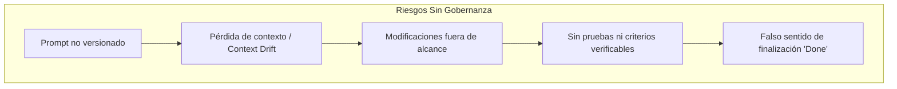
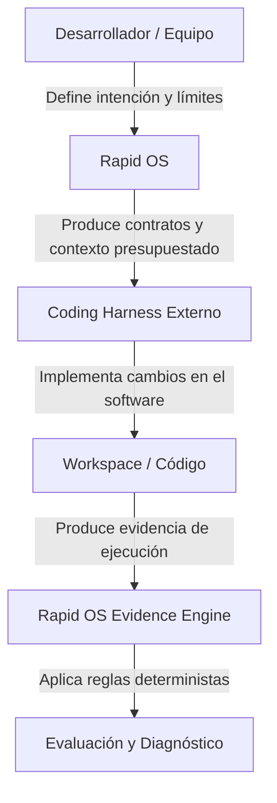

# Por qué Rapid OS

El desarrollo de software asistido por agentes de inteligencia artificial (AI coding harnesses) está transformando la velocidad de implementación. Sin embargo, en equipos de ingeniería reales, la velocidad sin control amplifica el riesgo técnico.

Rapid OS nace para resolver la brecha entre la **inferencia probabilística del modelo** y la **certeza determinista de la ingeniería de software**.

---

## El problema: los límites del desarrollo con agentes de IA

Cuando un desarrollador interactúa con un coding harness (como Codex, Claude, Cursor, Antigravity o VS Code Agent), surgen problemas estructurales recurrentes:

### 1. Pérdida y deriva de contexto (*Context Loss & Drift*)
Los modelos de lenguaje poseen una ventana de contexto finita y limitada. Cuando se les entrega el repositorio completo o instrucciones desestructuradas:
- Olvidan reglas de arquitectura o estándares de codificación previamente establecidos.
- Generan código incompatible con versiones de bibliotecas del proyecto.
- Alucinan supuestos cuando falta información explícita.

### 2. Especificaciones ambiguas vs. Prompts volátiles
Un prompt conversacional en una ventana de chat no es una especificación de ingeniería. No tiene versión, no queda registrado en el historial de Git, no define formalmente los criterios de aceptación (*acceptance criteria*) ni delimita qué cambios están estrictamente **fuera de alcance** (*out-of-scope*).

### 3. Modificaciones fuera de alcance (*Scope Creep*)
Un agente instruido para "corregir un error en el formulario de login" frecuentemente refactoriza componentes adyacentes, modifica dependencias innecesariamente o altera contratos públicos de la API, introduciendo regresiones difíciles de detectar.

### 4. Falta de evidencia verificable
Que un agente declare en su chat *"He completado la tarea y todos los tests pasan"* no constituye prueba técnica. Con frecuencia:
- Los tests ni siquiera fueron ejecutados.
- Se omitieron validaciones críticas.
- No queda registro criptográfico de qué archivos fueron leídos o modificados ni de los resultados reales de los comandos.

---

## La propuesta de valor: gobernanza basada en contratos

Rapid OS introduce una **capa de gobernanza y control determinista** alrededor del trabajo del coding harness, sin interferir con su capacidad generativa:

| Capacidad | Sin Rapid OS | Con Rapid OS v3 |
| :--- | :--- | :--- |
| **Inteligencia del repositorio** | El agente inspecciona ciegamente archivos aleatorios. | `rapid scan` extrae hechos tipados con procedencia y evidencia (`ProjectModel`). |
| **Especificación** | Prompts efímeros en chats. | `rapid spec` gestiona especificaciones inmutables versionadas en Git. |
| **Contexto** | Volcado masivo sin presupuesto de tokens. | `rapid context` compila contexto relevante, priorizado y con límite estricto de caracteres. |
| **Reglas de ejecución** | El agente opera sin restricciones explícitas. | `rapid policy` y `rapid run` fijan nivel de riesgo, workspace requerido y gates obligatorios. |
| **Capacidades del harness** | Se asume que el agente puede hacer todo. | `rapid harness` contrasta los permisos requeridos contra las capabilities declaradas. |
| **Verificación** | Confianza ciega en la respuesta del LLM. | `rapid evidence` y `rapid eval` evalúan evidencia física reproducible mediante reglas deterministas. |

---

## Para quién es Rapid OS

Rapid OS está diseñado para resolver necesidades reales en diferentes roles de la organización:

- **Desarrolladores individuales:** Para estructurar tareas complejas, evitar que el agente rompa partes no relacionadas del proyecto y compilar el contexto exacto para cada prompt.
- **Líderes técnicos y arquitectos:** Para preservar la integridad arquitectónica, controlar dependencias y definir de forma inmutable qué está permitido en cada iteración.
- **Equipos de ingeniería y DevOps:** Para asegurar que todo cambio generado por IA cuente con trazabilidad completa entre intención, especificación, diff de código y resultados de pruebas.
- **Equipos de QA y Compliance:** Para auditar con rigor matemático (SHA-256) qué ocurrió durante la ejecución de una tarea y disponer de evaluaciones deterministas independientes de cualquier LLM.
