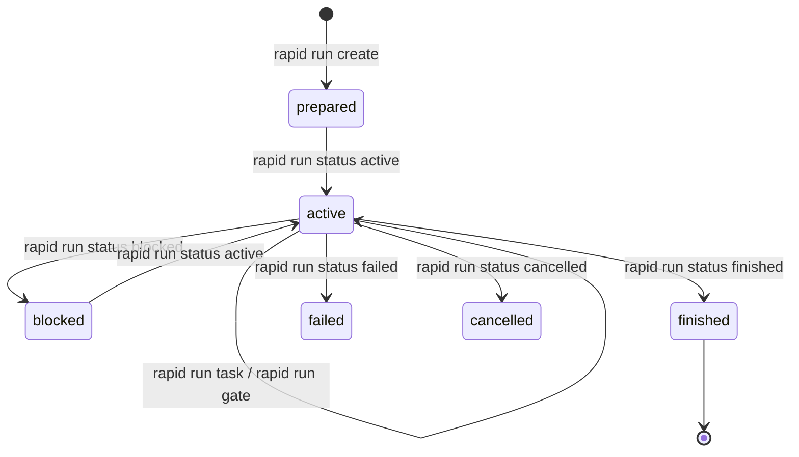

# Políticas y Contratos de Ejecución

En RAPID OS, el código no se modifica al azar ni por iniciativa no gobernada del agente. Cada ciclo de trabajo está mediado por un **Contrato de Ejecución** (`ExecutionContract`), el cual es evaluado deterministamente por el motor de **Políticas** (`ExecutionPolicyEvaluator`) contra `.rapid-os/policy.json`.

---

## 1. Inicialización y visualización de la política

RAPID OS cuenta con una política predeterminada integrada en el sistema. Puedes inspeccionarla o inicializar un archivo local para personalizarla a nivel de proyecto:

```bash
# Inspeccionar la política activa (default o proyecto)
rapid policy show

# Emitir en formato JSON puro
rapid policy show --json

# Inicializar .rapid-os/policy.json en el proyecto actual
rapid policy init
```

> **Nota**: Si `.rapid-os/policy.json` ya existe, `rapid policy init` abortará con el diagnóstico `RAPID1005` para evitar sobreescrituras accidentales.

---

## 2. Anatomía de `.rapid-os/policy.json`

Un archivo `.rapid-os/policy.json` sigue el esquema canónico versión 1:

```json
{
  "schema_version": 1,
  "minimum_classification": "spike",
  "minimum_risk": "low",
  "architectural_tags": [
    "architectural",
    "architecture",
    "auth",
    "authentication",
    "authorization",
    "ci",
    "database-migration",
    "database-schema",
    "deployment",
    "infra",
    "infrastructure",
    "migration",
    "migrations",
    "schema",
    "security"
  ],
  "architectural_path_prefixes": [
    ".github/workflows/",
    "alembic/",
    "auth/",
    "deploy/",
    "infra/",
    "migrations/",
    "prisma/",
    "security/",
    "supabase/migrations/",
    "terraform/"
  ],
  "high_risk_tags": [
    "architecture",
    "auth",
    "authentication",
    "ci",
    "database-migration",
    "database-schema",
    "deployment",
    "infra",
    "infrastructure",
    "migration",
    "migrations",
    "security"
  ],
  "critical_risk_tags": [
    "auth-migration",
    "breaking-change",
    "critical",
    "destructive-migration",
    "production-auth",
    "production-migration",
    "security-critical"
  ],
  "workspace_by_risk": {
    "low": "current_allowed",
    "medium": "current_allowed",
    "high": "isolated_required",
    "critical": "isolated_required"
  },
  "waivable_gate_ids": [
    "gate.review",
    "gate.tests"
  ],
  "extra_required_gate_ids": []
}
```

### Componentes clave

| Campo | Propósito | Valores permitidos |
| :--- | :--- | :--- |
| `schema_version` | Versión del schema de políticas | Entero positivo (`1`) |
| `minimum_classification` | Clasificación mínima impuesta para cualquier run | `"spike"`, `"bounded"`, `"architectural"` |
| `minimum_risk` | Nivel mínimo de riesgo asignado a cualquier run | `"low"`, `"medium"`, `"high"`, `"critical"` |
| `workspace_by_risk` | Requisito de aislamiento de entorno de trabajo por nivel de riesgo | Objeto con claves `low`, `medium`, `high`, `critical` y valores `"current_allowed"` o `"isolated_required"` |
| `waivable_gate_ids` | Subconjunto de compuertas que un humano puede eximir explícitamente con motivo justificado | Subconjunto de `["gate.review", "gate.tests"]` |
| `extra_required_gate_ids` | Compuertas adicionales requeridas incondicionalmente | Subconjunto de IDs del catálogo canónico de gates |
| `architectural_path_prefixes` | Prefijos de ruta que automáticamente elevan la clasificación a `architectural` si se modifican | Rutas relativas POSIX |
| `high_risk_tags` / `critical_risk_tags` | Etiquetas en specs que elevan el nivel de riesgo a `high` o `critical` | Lista de strings identificadores |

---

## 3. Catálogo Canónico de Compuertas (`CANONICAL_GATE_CATALOG`) {#compuertas-disponibles}

En los contratos de ejecución generados por RAPID OS, las compuertas se identifican mediante identificadores canónicos prefijados por `gate.`:

| Identificador canónico | `GateKind` subyacente | Fase | Significado y Evidencia esperada |
| :--- | :--- | :--- | :--- |
| `gate.workspace-isolation` | `workspace_isolation` | `pre_execution` | Verificación de ejecución en espacio aislado. Requiere evidencia `workspace`. |
| `gate.baseline` | `baseline_check` | `pre_execution` | Comprobación de salud antes de cambios. Requiere evidencia `test_result` o `command_result`. |
| `gate.manual-approval` | `manual_approval` | `pre_execution` | Aprobación pre-ejecución en riesgo crítico. Requiere evidencia `review` o `delegation`. |
| `gate.tests` | `implementation_tests` | `post_execution` | Pruebas de unidad o integración. Requiere evidencia `test_result` exitoso. |
| `gate.review` | `peer_review` | `post_execution` | Revisión arquitectónica o por pares. Requiere evidencia `review` aprobada. |
| `gate.security-review` | `security_review` | `post_execution` | Análisis o revisión de seguridad. Requiere evidencia `review` o `command_result`. |
| `gate.migration-review` | `migration_review` | `post_execution` | Revisión de scripts de migración. Requiere evidencia `review` especializada. |
| `gate.final-verification` | `final_verification` | `post_execution` | Verificación contractual de cierre de ciclo. Requiere evaluación completa del run. |

---

## 4. Ciclo de vida de un Contrato y su Estado (`RunState`)

Al ejecutar `rapid run create --spec <spec-id> --harness <harness-id>`, RAPID OS:
1. Resuelve la spec inmutable y su digest SHA-256.
2. Evalúa las rutas y tags contra `.rapid-os/policy.json`.
3. Emite un `PolicyDecision` con el riesgo y los gates requeridos.
4. Genera el contrato inmutable (`contract.json`).
5. Inicializa el estado en revisión 1 (`state_0001.json`) con estado `prepared`.



### Transiciones de Estado

```bash
# 1. Iniciar ejecución
rapid run status mi-run-001 active --reason "Inicio de implementación"

# 2. Actualizar tarea del contrato
rapid run task mi-run-001 T1 done --reason "Endpoints implementados con tests"

# 3. Reconocer compuerta con evidencia
rapid run gate mi-run-001 gate.baseline acknowledged --reason "Baseline verde confirmado"

# 4. Finalizar ejecución del run
rapid run status mi-run-001 finished --reason "Tareas concluidas y pruebas pasando"
```

---

## 5. Exenciones Justificadas (Waivers)

Si una compuerta está declarada en `waivable_gate_ids` dentro de la política (`gate.review`, `gate.tests`), se puede otorgar una exención cuando las circunstancias lo justifiquen:

```bash
rapid run gate \
  mi-run-001 \
  gate.review \
  waived \
  --reason "Exención autorizada por hotfix de emergencia en producción (incidente #992)"
```

> **Regla de integridad**: Si intentas eximir una compuerta que **no** está en `waivable_gate_ids`, RAPID OS rechazará la operación con el diagnóstico `RAPID1013`. Además, al evaluar el run (`rapid eval run`), el reporte marcará la compuerta como exenta y el veredicto pasará como `pass_with_waivers`.
