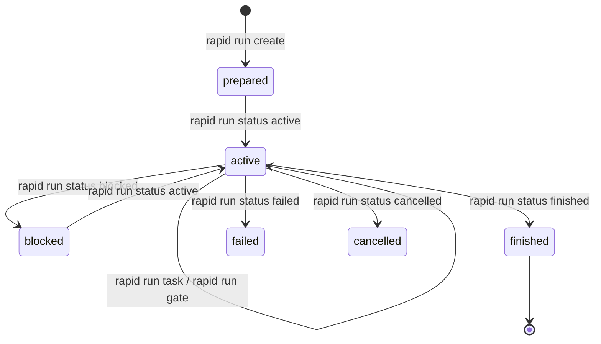

# Políticas y Contratos de Ejecución

En RAPID OS, el código no se modifica al azar ni por iniciativa no gobernada del agente. Cada ciclo de trabajo está mediado por un **Contrato de Ejecución** (`ExecutionContract`), el cual es evaluado deterministamente por el motor de **Políticas** (`ExecutionPolicyEvaluator`) contra `.rapid-os/policy.json`.

---

## 1. Inicialización y visualización de la política

RAPID OS cuenta con una política predeterminada integrada en el sistema. Puedes inspeccionarla o inicializar un archivo local para personalizarla a nivel de proyecto:

```bash
# Inspeccionar la política activa (default o proyecto)
rapid policy show

# Emitir en formato JSON puro
rapid policy show --json

# Inicializar .rapid-os/policy.json en el proyecto actual
rapid policy init
```

> **Nota**: Si `.rapid-os/policy.json` ya existe, `rapid policy init` abortará con el diagnóstico `RAPID1005` para evitar sobreescrituras accidentales.

---

## 2. Anatomía de `.rapid-os/policy.json`

Un archivo `.rapid-os/policy.json` sigue el esquema canónico versión 1:

```json
{
  "schema_version": 1,
  "default_risk": "medium",
  "gates_by_risk": {
    "low": ["implementation_tests"],
    "medium": ["baseline_check", "implementation_tests", "peer_review"],
    "high": ["baseline_check", "implementation_tests", "peer_review", "security_review", "workspace_isolation"],
    "critical": ["baseline_check", "implementation_tests", "peer_review", "security_review", "migration_review", "manual_approval", "workspace_isolation", "final_verification"]
  },
  "waivable_gates": [
    "baseline_check",
    "peer_review",
    "migration_review"
  ],
  "workspace_by_risk": {
    "low": "current_allowed",
    "medium": "current_allowed",
    "high": "isolated_required",
    "critical": "isolated_required"
  },
  "architectural_path_prefixes": [
    "src/core/",
    "domain/",
    "migrations/",
    ".rapid-os/"
  ],
  "high_risk_tags": ["auth", "payments", "crypto", "security"],
  "critical_risk_tags": ["database-schema", "data-loss", "kernel"]
}
```

### Componentes clave

| Campo | Propósito | Valores permitidos |
| :--- | :--- | :--- |
| `schema_version` | Versión del schema de políticas | Entero positivo (`1`) |
| `gates_by_risk` | Compuertas mínimas exigidas por cada nivel de riesgo | Lista ordenada de [`GateKind`](#compuertas-disponibles) |
| `waivable_gates` | Subconjunto de compuertas que un humano puede eximir explícitamente con motivo justificado | Subconjunto de compuertas |
| `workspace_by_risk` | Requisito de aislamiento de entorno de trabajo | `current_allowed` o `isolated_required` |
| `architectural_path_prefixes` | Prefijos de ruta que automáticamente elevan la clasificación a `architectural` si se modifican | Rutas relativas POSIX |
| `high_risk_tags` / `critical_risk_tags` | Etiquetas en specs que elevan el nivel de riesgo a `high` o `critical` | Lista de strings identificadores |

---

## 3. Compuertas disponibles (`GateKind`) {#compuertas-disponibles}

| Identificador | Significado | Evidencia mínima esperada |
| :--- | :--- | :--- |
| `baseline_check` | Comprobación del estado de pruebas y compilación antes del cambio | `test_result` o `command_result` |
| `implementation_tests` | Pruebas de unidad o integración del nuevo código | `test_result` exitoso |
| `peer_review` | Revisión de código por pares | `review` con veredicto aprobado |
| `security_review` | Revisión o análisis estático de seguridad | `review` o `command_result` (SAST) |
| `migration_review` | Revisión de scripts de migración de base de datos | `review` especializado en esquema |
| `workspace_isolation` | Verificación de ejecución en branch o worktree aislado | `workspace` |
| `manual_approval` | Firma o aprobación explícita de un líder técnico | `review` o `delegation` |
| `final_verification` | Ejecución final de la suite completa end-to-end | `test_result` completo |

---

## 4. Ciclo de vida de un Contrato y su Estado (`RunState`)

Al ejecutar `rapid run create --spec <spec-id> --harness <harness-id>`, RAPID OS:
1. Resuelve la spec inmutable y su digest SHA-256.
2. Evalúa las rutas y tags contra `.rapid-os/policy.json`.
3. Emite un `PolicyDecision` con el riesgo y los gates requeridos.
4. Genera el contrato inmutable (`contract.json`).
5. Inicializa el estado en revisión 1 (`state_0001.json`) con estado `prepared`.



### Transiciones de Estado

```bash
# 1. Iniciar ejecución
rapid run status mi-run-001 active --reason "Inicio de implementación"

# 2. Actualizar tarea del contrato
rapid run task mi-run-001 T1 done --reason "Endpoints implementados con tests"

# 3. Reconocer compuerta con evidencia
rapid run gate mi-run-001 baseline_check acknowledged --reason "Baseline verde confirmado"

# 4. Finalizar ejecución del run
rapid run status mi-run-001 finished --reason "Tareas concluidas y pruebas pasando"
```

---

## 5. Exenciones Justificadas (Waivers)

Si una compuerta está declarada en `waivable_gates` dentro de la política, se puede otorgar una exención cuando las circunstancias lo justifiquen:

```bash
rapid run gate \
  mi-run-001 \
  peer_review \
  waived \
  --reason "Exención autorizada por hotfix de emergencia en producción (incidente #992)"
```

> **Regla de integridad**: Si intentas eximir una compuerta que **no** está en `waivable_gates`, RAPID OS rechazará la operación con el diagnóstico `RAPID1013`. Además, al evaluar el run (`rapid eval run`), el reporte marcará la compuerta como exenta y el veredicto pasará como `pass_with_waivers`.
