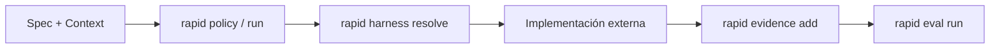

# Tu primer proyecto gobernado con RAPID OS

En este tutorial aprenderás a gobernar un proyecto desde cero utilizando el CLI de Rapid OS v3. Crearemos un proyecto Python mínimo y aplicaremos las primeras etapas del ciclo de gobernanza: inicialización de estándares, escaneo de inteligencia, creación de especificaciones inmutables y compilación de contexto para agentes de IA.

---

## Metadatos del tutorial

- **Objetivo:** Inicializar un proyecto, escanear sus hechos técnicos, crear una especificación formal y compilar contexto presupuestado para un coding harness.
- **Prerrequisitos:** Rapid OS instalado y disponible en la terminal (`rapid --version`).
- **Complejidad:** Inicial (sin dependencias externas ni servicios en la nube).

---

## Escenario: el proyecto `hello-rapid`

Vamos a crear un directorio de trabajo aislado con un script básico en Python:

```text
hello-rapid/
├── app.py
└── README.md
```

---

## Paso 1: Crear el proyecto mínimo

Abre tu terminal y ejecuta los siguientes comandos para preparar el directorio:

```bash
mkdir hello-rapid
cd hello-rapid

# Crear un archivo Python inicial
echo 'def main():\n    print("Hello from Rapid OS governed project")\n\nif __name__ == "__main__":\n    main()' > app.py

# Crear un archivo README básico
echo '# Hello Rapid Project\nProyecto de demostración para Rapid OS.' > README.md
```

---

## Paso 2: Inicializar RAPID OS (`rapid init`)

Ejecuta el comando de inicialización en la raíz del proyecto:

```bash
rapid init --archetype mvp --no-scan
```

*(También puedes ejecutar simplemente `rapid init` para utilizar el asistente interactivo).*

### ¿Qué ocurre internamente?
Rapid OS genera la estructura fundamental de gobernanza y archivos de contexto para los principales agentes de IA:

```text
hello-rapid/
├── .rapid-os/
│   ├── config.json              # Configuración del proyecto y stack
│   └── standards/
│       ├── tech-stack.md        # Definición del stack tecnológico
│       ├── topology.md          # Topología y arquitectura
│       └── ...
├── .cursorrules                 # Reglas de contexto para Cursor IDE
├── CLAUDE.md                    # Instrucciones de contexto para Claude / Anthropic
├── .agent/rules/constitution.md # Constitución para Antigravity
├── INSTRUCTIONS.md              # Estándares generales para coding agents
└── AGENTS.md                    # Mapeo de roles de agentes
```

:::note Respaldo automático con .bak
Si alguno de estos archivos ya existía previamente, Rapid OS crea una copia de seguridad con extensión `.bak` para evitar pérdida accidental de información.
:::

---

## Paso 3: Analizar el proyecto en modo lectura (`rapid scan`)

Ejecuta un escaneo determinista del repositorio:

```bash
rapid scan --verbose
```

### Conceptos clave del escaneo:
- **`ProjectModel`:** El modelo de datos resultante que unifica el conocimiento del repositorio.
- **`ProjectFact`:** Cada hecho técnico identificado (lenguaje Python detectado, estructura de archivos, etc.).
- **`Evidence`:** Procedencia demostrable de cada hecho (archivo leído, motivo de detección y nivel de confianza asignado).
- **Modo solo lectura:** `rapid scan` no modifica ningún archivo del repositorio a menos que se le indique explícitamente.

---

## Paso 4: Persistir Project Intelligence (`rapid scan --write`)

Para que los siguientes comandos del ciclo puedan consumir la inteligencia del proyecto sin volver a escanear el disco cada vez, persiste la instantánea:

```bash
rapid scan --write
```

Este comando escribe el archivo `.rapid-os/project.json` (`schema_version = 1`), que servirá como base de conocimiento estática e inmutable para la compilación de contexto y los contratos de ejecución.

---

## Paso 5: Crear tu primera especificación (`rapid spec create`)

En lugar de escribir un prompt suelto en un chat, define una especificación formal para la tarea: *"Implementar una función que valide nombres de usuario alfanuméricos"*:

```bash
rapid spec create \
  --id validate-username \
  --title "Validate Username Function" \
  --mode feature \
  --objective "Validar formato seguro de nombres de usuario" \
  --problem "Actualmente el sistema no valida caracteres especiales en nombres de usuario" \
  --scope "Crear función validate_username(username) que permita sólo caracteres alfanuméricos y guiones" \
  --acceptance "validate_username('juan_123') retorna True" \
  --acceptance "validate_username('juan@123') retorna False" \
  --task "Implementar función validate_username en app.py" \
  --status ready
```

### ¿Qué se generó?
Rapid OS crea el directorio `.rapid-os/specs/validate-username/` con:
- `spec.json`: Metadatos del registro.
- `revisions/0001.json`: La revisión inmutable congelada en estado `ready` con su correspondiente digest SHA-256 (`content_digest`).

---

## Paso 6: Consultar la especificación

Comprueba que la especificación esté registrada:

```bash
rapid spec list
```

**Salida esperada:**
Muestra la lista de specs registradas con su ID (`validate-username`), modo (`feature`), revisión actual (`0001`) y estado (`ready`).

Para ver los detalles completos de la especificación:
```bash
rapid spec show validate-username
```

---

## Paso 7: Compilar contexto para el agente (`rapid context`)

Ahora compilaremos el contexto exacto y presupuestado que entregaremos al coding harness (por ejemplo, Codex, Claude o Cursor):

```bash
rapid context \
  --mode feature \
  --spec validate-username \
  --harness codex \
  --manifest
```

### ¿Qué hace el compilador de contexto?
1. **Filtra por modo:** Selecciona únicamente los estándares y hechos del `ProjectModel` relevantes para una tarea de tipo `feature`.
2. **Incorpora la Spec:** Incluye la especificación `validate-username` en estado `ready`.
3. **Aplica presupuesto:** Asegura que el texto resultante no supere el límite de tokens/caracteres.
4. **Genera `ContextManifest`:** Describe las fuentes incluidas, sus tamaños y sus hashes SHA-256.
5. **Es 100% de solo lectura:** Emite el Markdown estructurado en `stdout` listo para ser consumido por el agente.

---

## Paso 8: Validar la integridad del proyecto (`rapid validate`)

Antes de iniciar la ejecución de código, verifica que la gobernanza del proyecto esté libre de discrepancias:

```bash
rapid validate
```

**Salida esperada:**
```text
==> Rapid OS Validation Report

Results:
  PASS - Project config: OK
  PASS - Standards: OK
  PASS - Project model snapshot: OK
  PASS - Spec registry: OK

Summary: 0 errors, 0 warnings. All registries valid.
```

Exit code: `0`. El proyecto cuenta con integridad total verificada.

---

## Paso 9: El siguiente paso en el Governance Loop

¡Has completado las primeras etapas de gobernanza! En este punto, el desarrollador o el harness implementa el cambio (`app.py`).

El ciclo continúa de la siguiente manera:



- **Policy y Run:** Congelan el `ExecutionContract` con los requisitos de gates y riesgo.
- **Harness:** Valida que la herramienta declare soporte para las capabilities requeridas.
- **Evidence:** Custodia la salida del comando de prueba (`python -m unittest`) con su SHA-256.
- **Eval:** Evalúa deterministamente si el run pasa (`PASS`).

Continúa explorando:
- [Gobernar un proyecto existente](./existing-project.md)
- [Ciclo de gobernanza completo](../governance-loop.md)
- [Referencia de CLI](../cli.md)
