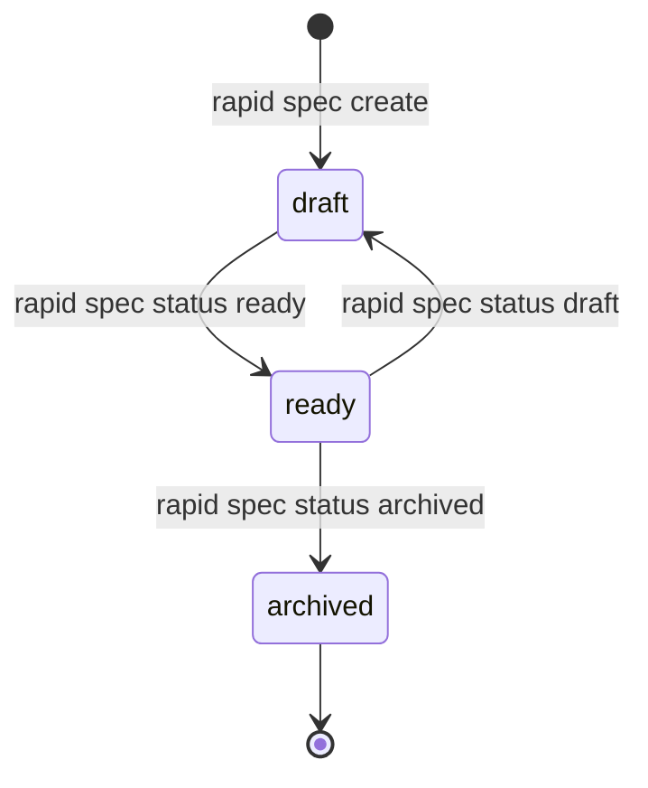

# Creación y gestión de especificaciones

En el desarrollo asistido por IA, una especificación imprecisa produce invariablemente código incorrecto o fuera de alcance. Rapid OS formaliza las intenciones del equipo en especificaciones versionadas e inmutables mediante el subcomando `rapid spec`.

---

## Anatomía de una especificación en Rapid OS

Cada especificación reside en `.rapid-os/specs/<spec-id>/` y se compone de campos estructurados:

| Parámetro | Requerido | Descripción |
| :--- | :--- | :--- |
| `--id` | Recomendado | Identificador único en formato slug (ej. `auth-rate-limit`). Se deriva de `--title` si se omite. |
| `--title` | Sí | Título legible de la especificación. |
| `--mode` | Sí | Tipo de tarea: `feature`, `bugfix`, `refactor`, `hardening` o `research`. |
| `--objective` | Sí | Objetivo de negocio que justifica el cambio. |
| `--problem` | Opcional | Declaración del problema actual o defecto detectado. |
| `--scope` | Opcional | Elementos que están expresamente dentro del alcance (repetible). |
| `--out-of-scope` | Opcional | Elementos expresamente excluidos para prevenir *scope creep* (repetible). |
| `--acceptance` | Recomendado | Criterios de aceptación verificables (repetible). |
| `--task` | Recomendado | Tareas atómicas de implementación (se convierten en `T001`, `T002`... en el contrato de ejecución). |
| `--status` | Opcional | Estado inicial: `draft` (por defecto) o `ready`. |

---

## Ciclo de vida de una especificación

Una especificación atraviesa tres estados claramente definidos:



1. **`draft`:** La especificación está siendo redactada y discutida. Los comandos de compilación de contexto y creación de runs la ignoran por defecto para evitar ejecuciones sobre especificaciones incompletas.
2. **`ready`:** La especificación ha sido aprobada y congelada. Sus criterios de aceptación y tareas son aptos para ser incluidos en contratos de ejecución (`rapid run create`).
3. **`archived`:** La tarea ha sido concluida o descartada. Se conserva para auditoría histórica.

---

## Ejemplo: Crear una especificación completa

```bash
rapid spec create \
  --id rate-limiting \
  --title "API Rate Limiting" \
  --mode feature \
  --objective "Proteger los endpoints de autenticación contra ataques de fuerza bruta" \
  --problem "Actualmente no existe límite de intentos en /api/v1/login" \
  --scope "Limitar a 5 intentos por minuto por dirección IP" \
  --out-of-scope "No implementar captcha en esta fase" \
  --acceptance "Retorna HTTP 429 tras superar 5 intentos fallidos" \
  --acceptance "Permite reintentar tras 60 segundos" \
  --task "Crear middleware de rate limit en src/middleware/rate_limit.py" \
  --task "Agregar pruebas unitarias para el middleware" \
  --status ready
```

---

## Revisiones inmutables y `rapid spec revise`

Rapid OS no sobrescribe revisiones existentes. Cuando necesitas modificar una especificación que ya fue congelada:

```bash
rapid spec revise rate-limiting \
  --objective "Ajustar ventana de bloqueo a 10 intentos por minuto"
```

Esto genera un nuevo archivo inmutable `revisions/0002.json` con su propio digest SHA-256. Si existía un run en progreso vinculado a la revisión `0001`, su contrato permanece inalterado y seguro contra manipulaciones accidentales.

---

## Consultar especificaciones registradas

```bash
# Listar todas las specs registradas
rapid spec list

# Filtrar por estado
rapid spec list --status ready

# Ver el detalle de una revisión concreta
rapid spec show rate-limiting
rapid spec show rate-limiting --revision 0001
```
