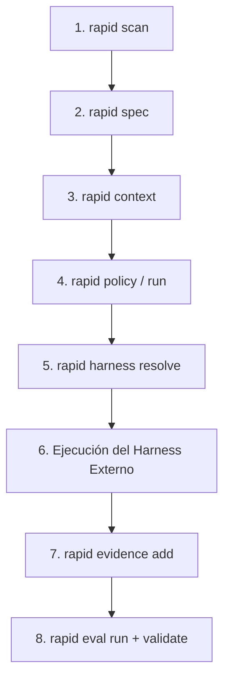

# Siguientes pasos en el Governance Loop

Has completado las etapas fundamentales de inicio en Rapid OS: análisis del repositorio (`scan`), definición de especificaciones inmutables (`spec`), compilación de contexto gobernado (`context`) y validación de integridad (`validate`).

A partir de este punto, el trabajo entra en el ciclo de **gobernanza de ejecución y verificación**.

---

## El ciclo completo de 8 fases

---

## Las etapas avanzadas de gobernanza

### 1. Políticas de ejecución (`rapid policy`)
Establece las reglas corporativas y de riesgo del equipo en `.rapid-os/policy.json`: qué niveles de riesgo (`low`, `medium`, `high`, `critical`) requieren espacios de trabajo aislados y qué gates de calidad son indispensables.

### 2. Contratos y ciclo de vida del Run (`rapid run`)
Crea un run con `rapid run create --spec <spec-id> --harness <harness-id>`. Esto genera un `ExecutionContract` inmutable y abre el libro contable de estados (`RunState`) para monitorear el progreso de tareas (`T001`...) y la disposición de gates (`gate.tests`...).

### 3. Resolución de capacidades (`rapid harness`)
Comprueba mediante `rapid harness resolve` si el perfil del agente seleccionado declara soporte para las operaciones requeridas por el contrato. Si el contrato requiere modificar archivos y el harness no declara `repository.write`, el proceso alerta la incompatibilidad antes de iniciar.

### 4. Ingesta de evidencia física (`rapid evidence`)
Al finalizar el trabajo del agente, recopila los resultados de ejecución (logs de comandos, reportes de pruebas, diffs de Git) con `rapid evidence add`. Los archivos se copian a `.rapid-os/evidence/<run-id>/artifacts/` con su tamaño y hash SHA-256 inmutable.

### 5. Evaluaciones deterministas de comportamiento (`rapid eval`)
Ejecuta `rapid eval run --run <run-id>`. El motor de evaluación analiza la evidencia física recopilada y emite un veredicto matemático (`PASS`, `PASS_WITH_WAIVERS`, `UNVERIFIED` o `FAIL`), garantizando que ninguna tarea se dé por completada sin prueba demostrable.

---

## Recursos recomendados

Para profundizar en cada una de estas áreas técnicas, consulta:

- **[Ciclo de gobernanza v3 detallado](../governance-loop.md):** Explicación profunda de las transiciones de estado, hashes cruzados y reglas lógicas.
- **[Capabilities y permisos del harness](../guides/permissions-capabilities.md):** Catálogo canónico de capacidades y perfiles de herramientas de IA.
- **[Estructura y límites de archivos](../guides/project-layout.md):** Qué directorios crea Rapid OS y cuáles son inmutables.
- **[Referencia completa de CLI](../cli.md):** Todos los comandos, argumentos, opciones y códigos de retorno del ejecutable `rapid`.
- **[Arquitectura de Rapid OS v3](../architecture/rapid-os-v3.md):** Especificación técnica para arquitectos e integradores.
