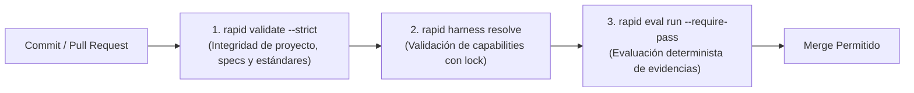

# Integración en CI/CD

RAPID OS no solo gobierna el trabajo local de los desarrolladores y agentes; sus comandos emiten códigos de salida estandarizados (`exit codes`) y documentos JSON puros (`--json`), lo que permite integrarlo de forma natural en pipelines de Integración Continua (CI/CD) como GitHub Actions, GitLab CI o Bitbucket Pipelines.

---

## Compuertas de CI recomendadas

En un pipeline de CI se recomienda ejecutar tres niveles de validación:



---

## 1. Validación de integridad del repositorio

Verifica que las plantillas, el snapshot de Project Intelligence, las especificaciones activas y los contratos no presenten errores ni desincronización:

```bash
rapid validate --strict
```

- **Exit code `0`**: Repositorio 100% íntegro sin warnings ni errores.
- **Exit code `1`**: Al menos un diagnóstico de advertencia o error está presente (bloquea el CI).

---

## 2. Validación de Capabilities bloqueadas

Si tu equipo utiliza perfiles declarativos con archivo lock (`.rapid-os/capabilities.lock`), asegura que ningún cambio degrade las capacidades requeridas:

```bash
rapid harness resolve --run "$RUN_ID" --locked --require-compatible
```

- **Exit code `0`**: El harness satisface todas las capacidades requeridas por el contrato.
- **Exit code `1`**: Se detecta incompatibilidad (`RAPID1110`).

---

## 3. Compuerta de Evaluación de Evidencia

Antes de hacer merge de un Pull Request originado en un run gobernado, verifica que la evidencia satisfaga las compuertas de calidad:

```bash
rapid eval run --run "$RUN_ID" --require-pass
```

- **Exit code `0`**: El veredicto es `PASS` o `PASS_WITH_WAIVERS`.
- **Exit code `1`**: El veredicto es `UNVERIFIED` (`RAPID1225`) o `FAIL` (`RAPID1226`).

---

## Ejemplo: Workflow completo en GitHub Actions

A continuación se muestra un archivo `.github/workflows/rapid-governance.yml` listo para producción:

```yaml
name: RAPID OS Governance & Integrity Check

on:
  pull_request:
    branches: [main, develop]
  push:
    branches: [main]

jobs:
  governance-audit:
    name: Repository Integrity & Contract Validation
    runs-on: ubuntu-latest

    steps:
      - name: Checkout repository
        uses: actions/checkout@v4

      - name: Set up Python
        uses: actions/setup-python@v5
        with:
          python-version: "3.12"
          cache: "pip"

      - name: Install RAPID OS
        run: |
          pip install .

      - name: Verify RAPID OS installation
        run: |
          rapid --version
          rapid doctor

      - name: Validate repository integrity (strict)
        run: |
          rapid validate --strict

      - name: Audit active runs and evaluations (Optional)
        run: |
          # Si existen runs activos en el PR, verificar que todos tengan veredicto PASS
          if [ -d ".rapid-os/runs" ]; then
            for run_dir in .rapid-os/runs/*/; do
              if [ -d "$run_dir" ]; then
                run_id=$(basename "$run_dir")
                echo "Auditing run: $run_id"
                rapid eval run --run "$run_id" --require-pass
              fi
            done
          fi
```

---

## Automatización en pre-commit hooks

Puedes agregar RAPID OS a tu archivo `.pre-commit-config.yaml` para atrapar inconsistencias antes del commit local:

```yaml
repos:
  - repo: local
    hooks:
      - id: rapid-validate
        name: RAPID OS Integrity Check
        entry: rapid validate --strict
        language: system
        pass_filenames: false
```
