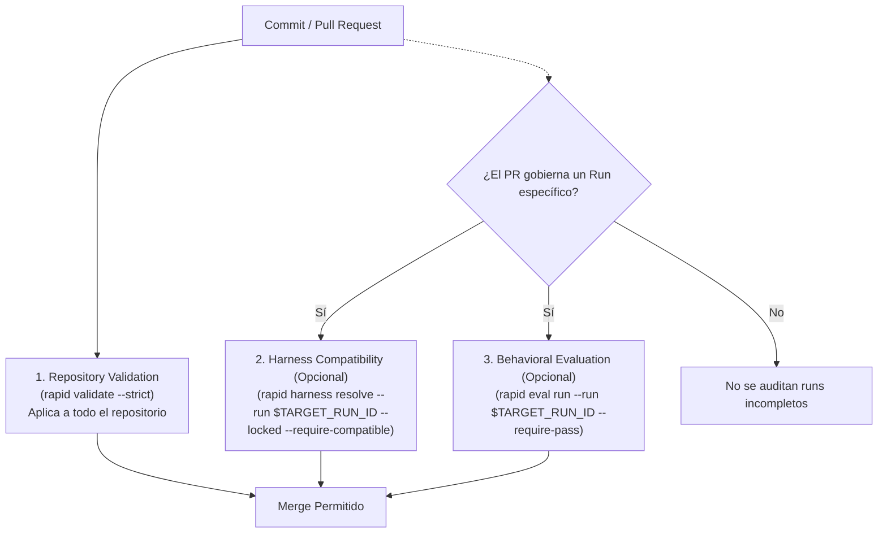

# Integración en CI/CD

RAPID OS no solo gobierna el trabajo local de los desarrolladores y coding harnesses; sus comandos emiten códigos de salida estandarizados (`exit codes`) y documentos JSON deterministas (`--json`), lo que facilita su integración en pipelines de Integración Continua (CI/CD) como GitHub Actions, GitLab CI o Bitbucket Pipelines.

---

## Compuertas de CI Independientes

En un pipeline de CI se pueden incorporar tres controles independientes según la fase del ciclo de trabajo:



---

## 1. Validación de Integridad del Repositorio (Control Base)

Este control es **universal y seguro para cualquier repositorio o PR**. No asume que existan runs activos ni evidencias previas; valida que las plantillas, el snapshot de Project Intelligence, las especificaciones y la configuración no presenten errores:

```bash
rapid validate --strict
```

- **Exit code `0`**: El repositorio está 100% íntegro sin errores ni advertencias diagnósticas.
- **Exit code `1`**: Al menos un diagnóstico de advertencia o error está presente (bloquea el pipeline).

---

## 2. Validación de Capabilities del Harness (Control Específico)

Aplica cuando el PR está asociado a un run preparado y el equipo utiliza perfiles declarativos con archivo lock (`.rapid-os/capabilities.lock`):

```bash
# Requiere: TARGET_RUN_ID identificado y capabilities.lock presente
rapid harness resolve --run "$TARGET_RUN_ID" --locked --require-compatible
```

- **Exit code `0`**: El harness satisface todas las capabilities obligatorias exigidas por el contrato.
- **Exit code `1`**: Se detecta incompatibilidad (`RAPID1110`).

---

## 3. Compuerta de Evaluación de Comportamiento (Control de Cierre)

Aplica **únicamente sobre el Run específico que fue completado en el PR**. 

> **Advertencia de Product Truth**: **Nunca** ejecutes `rapid eval run --require-pass` en un bucle ciego sobre todas las carpetas dentro de `.rapid-os/runs/`. El directorio de runs puede contener runs preparados, pausados, cancelados o históricos que legítimamente no cuentan con evidencias completas todavía. La evaluación debe apuntar explícitamente al `TARGET_RUN_ID` del cambio actual.

```bash
# Requiere: TARGET_RUN_ID con ejecución externa finalizada y evidencias registradas
rapid eval run --run "$TARGET_RUN_ID" --require-pass
```

- **Exit code `0`**: El veredicto es `PASS` o `PASS_WITH_WAIVERS`.
- **Exit code `1`**: El veredicto es `UNVERIFIED` (`RAPID1225`) o `FAIL` (`RAPID1226`).

---

## Ejemplo de Referencia: Workflow en GitHub Actions

A continuación se muestra un workflow de referencia configurado con **permisos mínimos** (`contents: read`):

```yaml
name: RAPID OS Governance & Integrity Check

on:
  pull_request:
    branches: [main, develop]
  push:
    branches: [main]

permissions:
  contents: read

jobs:
  governance-validation:
    name: Repository Integrity Validation
    runs-on: ubuntu-latest

    steps:
      - name: Checkout repository
        uses: actions/checkout@v4

      - name: Set up Python
        uses: actions/setup-python@v5
        with:
          python-version: "3.12"
          cache: "pip"

      - name: Install RAPID OS
        run: |
          pip install .

      - name: Verify RAPID OS installation
        run: |
          rapid --version
          rapid doctor

      - name: Validate repository integrity (strict)
        run: |
          rapid validate --strict

      - name: Evaluate target governed run (if specified)
        if: env.TARGET_RUN_ID != ''
        env:
          TARGET_RUN_ID: ${{ vars.TARGET_RUN_ID }}
        run: |
          echo "Auditing specific run: $TARGET_RUN_ID"
          rapid eval run --run "$TARGET_RUN_ID" --require-pass
```

---

## Integración en Pre-commit Hooks

Puedes incorporar la validación estricta de RAPID OS en tu archivo `.pre-commit-config.yaml` para asegurar la integridad de la configuración y especificaciones antes de confirmar cambios locales:

```yaml
repos:
  - repo: local
    hooks:
      - id: rapid-validate
        name: RAPID OS Integrity Check
        entry: rapid validate --strict
        language: system
        pass_filenames: false
```
