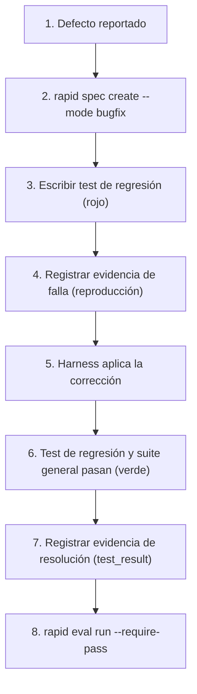

# Modo Bugfix

El modo **Bugfix** prioriza la reproducción verificable del error, la contención del alcance para evitar efectos secundarios y la adición obligatoria de una prueba de regresión antes de declarar resuelto el defecto.

---

## Principios del modo Bugfix

1. **No hay fix sin prueba de regresión**: Todo defecto debe reproducirse primero mediante una prueba que falle.
2. **Alcance mínimo**: El parche debe limitarse estrictamente a corregir la causa raíz sin introducir refactorizaciones oportunistas.
3. **Evidencia de no-regresión**: Se debe registrar evidencia de que la suite general de pruebas sigue aprobando al 100%.

---

## Flujo paso a paso



---

## 1. Registrar la especificación del Bugfix

```bash
rapid spec create \
  --title "Fix timeout en reconciliación de balance" \
  --mode bugfix \
  --objective "Corregir bloqueo por concurrencia en la consulta de saldos" \
  --scope "Servicio de reconciliación y queries SQL transaccionales" \
  --acceptance "Test de estrés concurrente pasa sin interbloqueos en <500ms" \
  --task "1. Reproducir el deadlock en test de integración" \
  --task "2. Aplicar SELECT ... FOR UPDATE SKIP LOCKED" \
  --task "3. Verificar ausencia de regresión en balance general" \
  --status ready
```

---

## 2. Compilar el contexto con foco en el defecto

```bash
rapid context \
  --spec fix-timeout-en-reconciliacion-de-balance \
  --harness codex \
  --mode bugfix \
  --path "services/reconciliation" \
  --path "tests/integration/test_reconciliation.py" \
  --manifest
```

---

## 3. Crear el Run y vincular la política

```bash
rapid run create \
  --spec fix-timeout-en-reconciliacion-de-balance \
  --harness codex \
  --classification bounded \
  --risk medium
```

---

## 4. Capturar Evidencia de Reproducción y Resolución

### Paso A: Evidencia del fallo inicial
Registra que el defecto fue reproducido fehacientemente antes del fix:

```json
{
  "step": "reproduction",
  "test_target": "tests/integration/test_reconciliation.py::test_concurrent_reconciliation",
  "exit_code": 1,
  "error_message": "DeadlockDetected: Transaction 402 blocked on lock"
}
```

```bash
rapid evidence add \
  --run fix-timeout-en-reconciliacion-de-balance-r1-run-001 \
  --kind test_result \
  --producer "pytest-reproduction" \
  --summary "Falla de concurrencia reproducida en test de integración" \
  --input reproduction-evidence.json
```

### Paso B: Evidencia de la corrección y no-regresión
Una vez aplicado el cambio en el código y aprobadas todas las pruebas:

```json
{
  "step": "resolution",
  "suite": "all_tests",
  "passed": 48,
  "failed": 0,
  "regression_test_passed": true,
  "exit_code": 0
}
```

```bash
rapid evidence add \
  --run fix-timeout-en-reconciliacion-de-balance-r1-run-001 \
  --kind test_result \
  --producer "pytest-full-suite" \
  --summary "Suite completa verde incluyendo nuevo test de regresión" \
  --input resolution-evidence.json
```

---

## 5. Evaluación final del Run

Ejecuta la evaluación final:

```bash
rapid eval run \
  --run fix-timeout-en-reconciliacion-de-balance-r1-run-001 \
  --write \
  --require-pass
```

El veredicto confirmará que las compuertas de pruebas (`implementation_tests`) fueron satisfechas con evidencia empírica.
