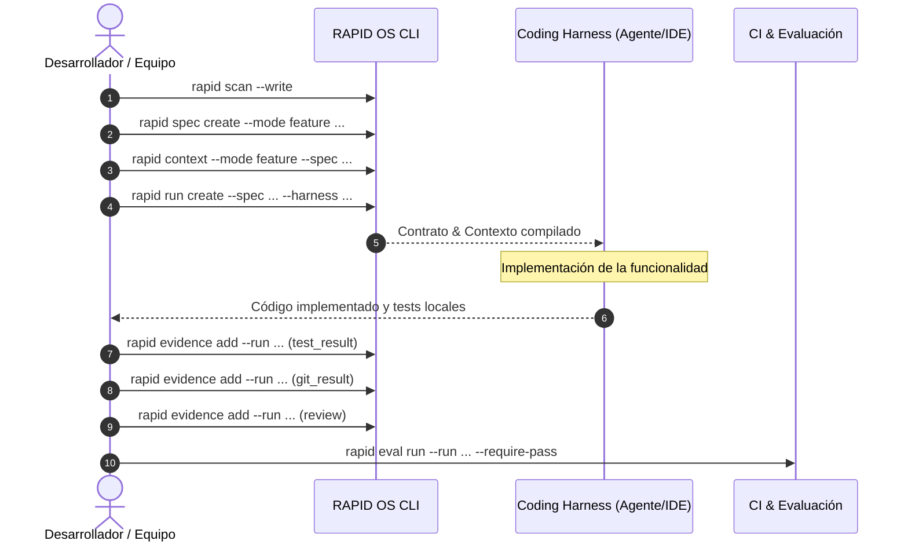

# Modo Feature

El modo **Feature** está diseñado para implementar nuevas capacidades funcionales dentro de un sistema asegurando que no se rompan contratos existentes ni se desvíe el diseño arquitectónico.

---

## Flujo paso a paso



---

## 1. Inspeccionar el proyecto y registrar la especificación

Antes de que el agente escriba código, captura el estado actual y formaliza la spec:

```bash
# 1. Actualizar Project Intelligence
rapid scan --write

# 2. Registrar la especificación en estado 'ready'
rapid spec create \
  --title "Notificaciones por Webhook" \
  --mode feature \
  --objective "Emitir eventos de pago completado vía webhooks HTTP" \
  --scope "Servicio de eventos y cliente HTTP con retries" \
  --acceptance "Webhook firmado con HMAC-SHA256 y tests de entrega exitosos" \
  --task "1. Crear modelo de webhook" \
  --task "2. Implementar dispatcher asíncrono con exponential backoff" \
  --task "3. Añadir suite de tests unitarios y de integración" \
  --status ready
```

---

## 2. Compilar el contexto para el Coding Harness

Compila el paquete de contexto acotado al presupuesto de tokens, asociando la spec y el perfil de harness:

```bash
rapid context \
  --spec notificaciones-por-webhook \
  --harness codex \
  --mode feature \
  --manifest
```

Revisa el manifest para confirmar qué archivos de estándares (`architecture.md`, `standards/python.md`) y del proyecto fueron incluidos o excluidos por presupuesto.

---

## 3. Crear el contrato de ejecución (`ExecutionContract`)

Genera el run formal en `.rapid-os/runs/`:

```bash
rapid run create \
  --spec notificaciones-por-webhook \
  --harness codex \
  --classification bounded \
  --risk medium
```

Esto evaluará la política (`.rapid-os/policy.json`) y definirá las compuertas necesarias (ej. `baseline_check`, `implementation_tests`, `peer_review`).

Verifica la compatibilidad del harness:

```bash
rapid harness resolve --run notificaciones-por-webhook-r1-run-001 --require-compatible
```

---

## 4. Ejecución asistida por el Harness

Entrega el contexto compilado y el objetivo a tu coding harness (Cursor, Claude Code, Copilot, Codex o Antigravity).

Durante la ejecución:
- El harness debe implementar el modelo, el dispatcher y las pruebas.
- No debe modificar archivos fuera del alcance (`--scope`) definido en la spec.

---

## 5. Ingesta de Evidencias

Una vez finalizada la implementación y ejecutadas las pruebas por las herramientas del entorno, registra la evidencia verificable:

### Evidencia de pruebas ejecutadas (`test_result`)
Crea un archivo temporal de payload de pruebas (por ejemplo `test-evidence.json`):

```json
{
  "test_framework": "pytest",
  "passed": 12,
  "failed": 0,
  "skipped": 0,
  "exit_code": 0,
  "duration_seconds": 2.45
}
```

Regístralo en el run:

```bash
rapid evidence add \
  --run notificaciones-por-webhook-r1-run-001 \
  --kind test_result \
  --producer "ci-pytest" \
  --summary "12 tests unitarios y de integración aprobados" \
  --input test-evidence.json
```

### Evidencia de cambios en git (`git_result`)
Registra la evidencia de los archivos modificados:

```json
{
  "operation": "diff_summary",
  "files_changed": 4,
  "insertions": 180,
  "deletions": 12
}
```

```bash
rapid evidence add \
  --run notificaciones-por-webhook-r1-run-001 \
  --kind git_result \
  --producer "git-diff" \
  --summary "4 archivos agregados en domain y tests" \
  --input git-evidence.json
```

---

## 6. Verificación y Evaluación Final

1. Verifica la integridad matemática de la secuencia de evidencias:
   ```bash
   rapid evidence verify --run notificaciones-por-webhook-r1-run-001
   ```

2. Ejecuta la evaluación determinista contra las reglas de comportamiento:
   ```bash
   rapid eval run \
     --run notificaciones-por-webhook-r1-run-001 \
     --write \
     --require-pass
   ```

Si todas las compuertas y reglas se satisfacen, el veredicto será `PASS` y el reporte se archivará de forma inmutable en `.rapid-os/evals/`.
