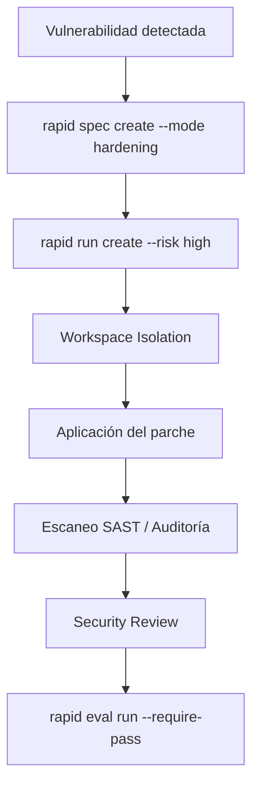

# Modo Hardening

El modo **Hardening** gobierna intervenciones de alta sensibilidad: parcheo de vulnerabilidades (CVEs), actualización de dependencias críticas, fortalecimiento de políticas de autenticación/criptografía, y auditorías de seguridad en infraestructura de código.

---

## Características del modo Hardening en RAPID OS

- **Riesgo elevado**: Típicamente evaluado en `high` (80) o `critical` (100).
- **Workspace Isolation**: La política puede requerir un entorno o branch/worktree aislado (`isolated_required`).
- **Compuertas obligatorias**:
  - `security_review`: Aprobación formal de seguridad.
  - `peer_review`: Revisión humana por pares.
  - `final_verification`: Auditoría estática o escaneo de vulnerabilidades sin hallazgos críticos.



---

## 1. Especificación del Hardening

```bash
rapid spec create \
  --title "Mitigación CVE en parser XML y sanitización de inputs" \
  --mode hardening \
  --objective "Actualizar parser XML vulnerable a XXE y restringir deserialización arbitraria" \
  --scope "Módulo parsers/xml y dependencias pyproject.toml" \
  --acceptance "DefLibraries actualizadas, cero alertas en escaneo SAST y tests de inyección bloqueados" \
  --task "1. Actualizar biblioteca defensiva" \
  --task "2. Configurar defusedxml deshabilitando entidades externas" \
  --task "3. Añadir tests de ataque XXE simulados" \
  --status ready
```

---

## 2. Compilar el Contexto de Seguridad

```bash
rapid context \
  --spec mitigacion-cve-en-parser-xml-y-sanitizacion-de-inputs \
  --harness claude \
  --mode hardening \
  --constraint "Prohibido el uso de parsers sin validación estricta" \
  --manifest
```

---

## 3. Crear el Run de Alto Riesgo

```bash
rapid run create \
  --spec mitigacion-cve-en-parser-xml-y-sanitizacion-de-inputs \
  --harness claude \
  --classification architectural \
  --risk high
```

Al asignar riesgo `high`, el contrato de ejecución (`ExecutionContract`) activará las compuertas `security_review` y `workspace_isolation`.

---

## 4. Ingesta de Evidencias de Seguridad

### Evidencia de escaneo estático / SAST (`command_result`)
```json
{
  "kind": "command_result",
  "producer": "bandit-scanner",
  "summary": "Auditoría de seguridad Bandit sin hallazgos de severidad media o alta",
  "capability_ids": ["shell.execute"],
  "payload": {
    "label": "bandit -r src/xml_parser",
    "exit_code": 0
  }
}
```

```bash
rapid evidence add \
  --run mitigacion-cve-en-parser-xml-y-sanitizacion-de-inputs-r1-run-001 \
  --input sast-evidence.json
```

### Evidencia de revisión humana de seguridad (`review`)
```json
{
  "kind": "review",
  "producer": "appsec-portal",
  "summary": "Aprobación formal del equipo de Application Security",
  "gate_ids": ["security_review"],
  "payload": {
    "review_type": "security",
    "outcome": "approved",
    "reviewer": "appsec-team"
  }
}
```

```bash
rapid evidence add \
  --run mitigacion-cve-en-parser-xml-y-sanitizacion-de-inputs-r1-run-001 \
  --input review-evidence.json
```

Reconoce la compuerta en el estado del run:

```bash
rapid run gate \
  mitigacion-cve-en-parser-xml-y-sanitizacion-de-inputs-r1-run-001 \
  security_review \
  acknowledged \
  --reason "Revisión aprobada por equipo de seguridad"
```

---

## 5. Evaluación de Cumplimiento

```bash
rapid eval run \
  --run mitigacion-cve-en-parser-xml-y-sanitizacion-de-inputs-r1-run-001 \
  --write \
  --require-pass
```

El veredicto final certificará que los requerimientos de seguridad y las evidencias vinculadas satisfacen la política de ejecución antes de cualquier despliegue.
