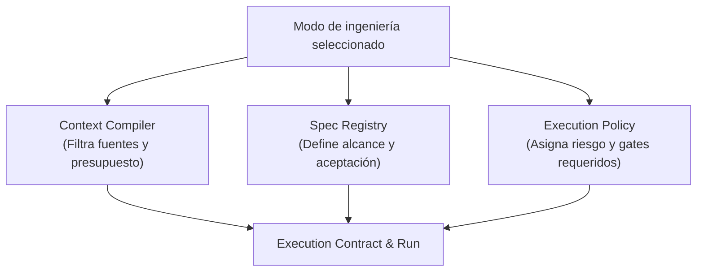

# Modos de ingeniería

RAPID OS clasifica el trabajo de ingeniería en **modos declarativos**. Cada modo define la intención del ciclo de trabajo y ajusta:

1. **Context Compiler**: Qué estándares, reglas de arquitectura y restricciones se incluyen o priorizan en el bundle de contexto generado (`rapid context --mode <mode>`).
2. **Spec Registry**: La naturaleza de los requerimientos y criterios de aceptación definidos en la especificación (`rapid spec create --mode <mode>`).
3. **Execution Policy**: La evaluación de riesgos (`RiskLevel`), clases de ejecución (`ExecutionClass`) y las compuertas de calidad (`GateKind`) requeridas antes de completar un run.



---

## Modos disponibles

RAPID OS soporta los siguientes cinco modos operativos canónicos:

| Modo | Intención principal | Enfoque de contexto | Riesgo típico | Gates sugeridos |
| :--- | :--- | :--- | :--- | :--- |
| [`feature`](./feature.md) | Nueva funcionalidad o capacidad | Requisitos funcionales, contratos de API, estándares de diseño | `medium` (50) a `high` (80) | Baseline, tests unitarios/integración, peer review |
| [`bugfix`](./bugfix.md) | Corrección de defectos o regresiones | Caso de reproducción, código afectado, pruebas existentes | `low` (10) a `medium` (50) | Baseline, test de regresión, review |
| [`refactor`](./refactor.md) | Mejora de estructura sin alterar comportamiento | Arquitectura, contratos de interfaz, suite completa de tests | `medium` (50) a `high` (80) | Baseline estricto, suite de tests sin cambios de API, peer review |
| [`hardening`](./hardening.md) | Seguridad, robustez, observabilidad, dependencias | Vulnerabilidades, políticas de seguridad, dependencias | `high` (80) a `critical` (100) | Security review, auditoría estática, verificación aislada |
| [`research`](./research.md) | Spikes exploratorios y prototipos de viabilidad | Contexto abierto, documentación técnica, pruebas de concepto | `low` (10) (`ExecutionClass.SPIKE`) | Gates mínimos o waiveables, no altera código crítico |

---

## Cómo influye el modo en los comandos de RAPID OS

### 1. En la compilación de contexto (`rapid context`)
Al invocar `rapid context --mode <mode>`, el compilador de contexto selecciona las secciones de estándares más pertinentes:

```bash
# Compilar contexto enfocado en una nueva funcionalidad
rapid context --mode feature --objective "Agregar autenticación OAuth2" --manifest

# Compilar contexto enfocado en endurecimiento de seguridad
rapid context --mode hardening --objective "Rotación de secrets y sanitización de inputs" --manifest
```

### 2. En la creación de la especificación (`rapid spec create`)
La especificación formal registra el modo para asegurar trazabilidad entre el diseño y la ejecución:

```bash
rapid spec create \
  --title "Migrar endpoint de checkout a v2" \
  --mode refactor \
  --objective "Reestructurar handlers desacoplando la capa de persistencia" \
  --scope "Servicio de pagos y controladores HTTP" \
  --acceptance "100% tests verdes sin modificar contratos externos" \
  --status ready
```

### 3. En la creación del run (`rapid run create`)
Al generar un run a partir de una spec, la política de ejecución evalúa el modo junto con las etiquetas (`tags`) y rutas afectadas para calcular la clase de ejecución:

```bash
rapid run create --spec checkout-v2 --harness codex
```

---

## Siguiente paso

Explora la guía detallada de cada modo para comprender el flujo paso a paso y los tipos de evidencia requeridos:

- [Modo Feature](./feature.md)
- [Modo Bugfix](./bugfix.md)
- [Modo Refactor](./refactor.md)
- [Modo Hardening](./hardening.md)
- [Modo Research](./research.md)
