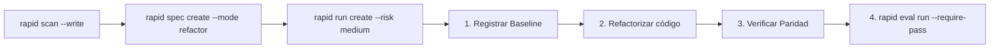

# Modo Refactor

El modo **Refactor** gobierna cambios en la estructura interna del código (simplificación, desacoplamiento, rendimiento, eliminación de deuda técnica) garantizando que los contratos externos y el comportamiento observable se mantengan idénticos.

---

## Reglas de oro del Refactor en RAPID OS

1. **Invarianza de comportamiento**: Si los tests funcionales existentes requieren modificaciones de aserción para pasar, no es un refactor puro; es un cambio funcional encubierto.
2. **Baseline obligatorio**: Debe existir una foto verificada del estado de las pruebas antes de modificar la primera línea de código.
3. **Paridad de suite**: La misma suite de pruebas debe ejecutarse antes y después con 0 fallos.

---

## Flujo paso a paso



---

## 1. Especificación del Refactor

Registra los límites exactos de la reestructuración:

```bash
rapid spec create \
  --title "Desacoplar capa de persistencia en pagos" \
  --mode refactor \
  --objective "Extraer repositorio abstracto para aislar la base de datos de la lógica de dominio" \
  --scope "Módulo payments/ y adapters/db/" \
  --acceptance "0 cambios en firmas públicas de servicios y suite de 150 tests pasando al 100%" \
  --task "1. Definir PaymentRepositoryProtocol" \
  --task "2. Implementar PostgresPaymentRepository" \
  --task "3. Inyectar dependencia en PaymentService" \
  --status ready
```

---

## 2. Iniciar el Run y registrar el Baseline

Crea el run en RAPID OS:

```bash
rapid run create \
  --spec desacoplar-capa-de-persistencia-en-pagos \
  --harness codex \
  --classification bounded \
  --risk medium
```

### Captura de Evidencia Baseline
Ejecuta la suite completa sobre el código original y añade la evidencia:

```json
{
  "kind": "test_result",
  "producer": "pytest-baseline",
  "summary": "Baseline de 150 tests aprobados en código original",
  "gate_ids": ["baseline_check"],
  "payload": {
    "suite": "all-tests-baseline",
    "exit_code": 0,
    "passed": 150,
    "failed": 0,
    "skipped": 0
  }
}
```

```bash
rapid evidence add \
  --run desacoplar-capa-de-persistencia-en-pagos-r1-run-001 \
  --input baseline-evidence.json
```

Acredita la compuerta de baseline en el estado del run:

```bash
rapid run gate \
  desacoplar-capa-de-persistencia-en-pagos-r1-run-001 \
  baseline_check \
  acknowledged \
  --reason "Baseline ejecutado y verificado en 150 tests verdes"
```

---

## 3. Ejecución del Refactor en el Harness

Entrega las instrucciones a tu agente o asistente de código asegurando que no toque los archivos de pruebas de contrato existentes.

---

## 4. Captura de Evidencia Posterior y Diff

### Evidencia de paridad de pruebas
```json
{
  "kind": "test_result",
  "producer": "pytest-post-refactor",
  "summary": "150 tests aprobados post-refactor con cero fallos",
  "gate_ids": ["implementation_tests"],
  "payload": {
    "suite": "all-tests-post-refactor",
    "exit_code": 0,
    "passed": 150,
    "failed": 0,
    "skipped": 0
  }
}
```

```bash
rapid evidence add \
  --run desacoplar-capa-de-persistencia-en-pagos-r1-run-001 \
  --input post-evidence.json
```

### Evidencia de cambios de archivos (`file_change`)
```json
{
  "kind": "file_change",
  "producer": "git-inspector",
  "summary": "Reestructuración confinada al módulo payments sin tocar tests",
  "payload": {
    "paths": [
      "payments/service.py",
      "payments/repositories.py"
    ]
  }
}
```

```bash
rapid evidence add \
  --run desacoplar-capa-de-persistencia-en-pagos-r1-run-001 \
  --input files-evidence.json
```

---

## 5. Evaluación de Comportamiento

```bash
rapid eval run \
  --run desacoplar-capa-de-persistencia-en-pagos-r1-run-001 \
  --write \
  --require-pass
```

El motor de evaluación confirmará que la compuerta de baseline y las pruebas de implementación están verificadas con evidencia matemática idónea.
