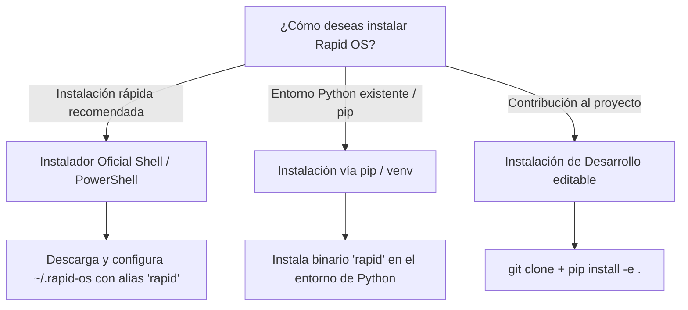

# Instalación de Rapid OS

Rapid OS se distribuye como una herramienta de línea de comandos (`rapid` o `python rapid.py`). El núcleo de gobernanza está implementado íntegramente en Python y no requiere dependencias externas obligatorias para su funcionamiento básico.

---

## Elige tu método de instalación

Existen dos vías principales para instalar Rapid OS según tu flujo de trabajo:



### 1. Instalador rápido por sistema operativo (Recomendado)

Los instaladores automatizados clonan el repositorio en `~/.rapid-os`, fijan la versión estable y configuran el comando `rapid` en tu terminal:

- **[Instalación en Windows](./windows.md):** Script de PowerShell optimizado para Windows 10/11.
- **[Instalación en Linux](./linux.md):** Script Bash compatible con Ubuntu, Debian, Fedora, Arch y derivados.
- **[Instalación en macOS](./macos.md):** Compatible con Apple Silicon (M1/M2/M3/M4) e Intel.
- **[Instalación en WSL](./wsl.md):** Guía específica para Windows Subsystem for Linux.

### 2. Instalación mediante `pip` en un entorno virtual

Si prefieres gestionar Rapid OS dentro de un entorno virtual de Python (`venv`):

```bash
# Crear y activar entorno virtual
python -m venv .venv
source .venv/bin/activate  # En Windows: .venv\Scripts\Activate.ps1

# Instalar desde el repositorio o paquete
python -m pip install git+https://github.com/alyconr/Rapid-OS.git@v3.0.0
```

---

## Diferencia entre versión Estable y Desarrollo

:::info Canales de instalación
- **Versión Estable (`v3.0.0`):** Pinned al tag oficial [`v3.0.0`](https://github.com/alyconr/Rapid-OS/releases/tag/v3.0.0). Recomendada para producción y equipos de desarrollo.
- **Versión de Desarrollo (`main`):** Obtenida mediante checkout de la rama `main` en desarrollo activo. Contiene las últimas características antes de su empaquetado formal.
:::

---

## Pasos siguientes

1. Revisa los [Requisitos del sistema](./requirements.md).
2. Sigue la guía correspondiente a tu sistema operativo.
3. Ejecuta la [Verificación de la instalación](./verification.md) para comprobar que el CLI responde correctamente.
